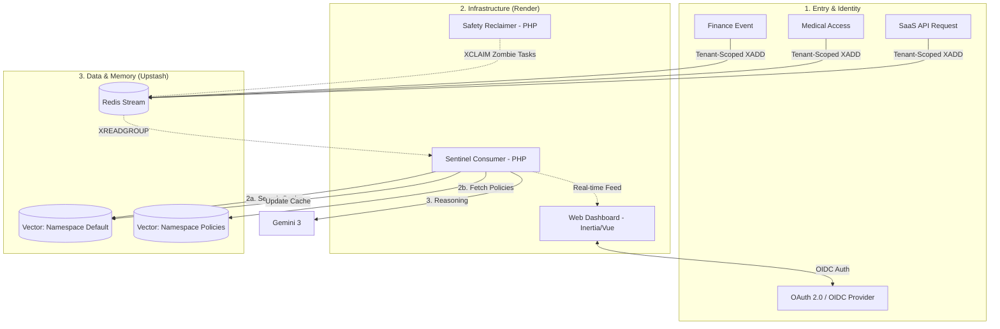
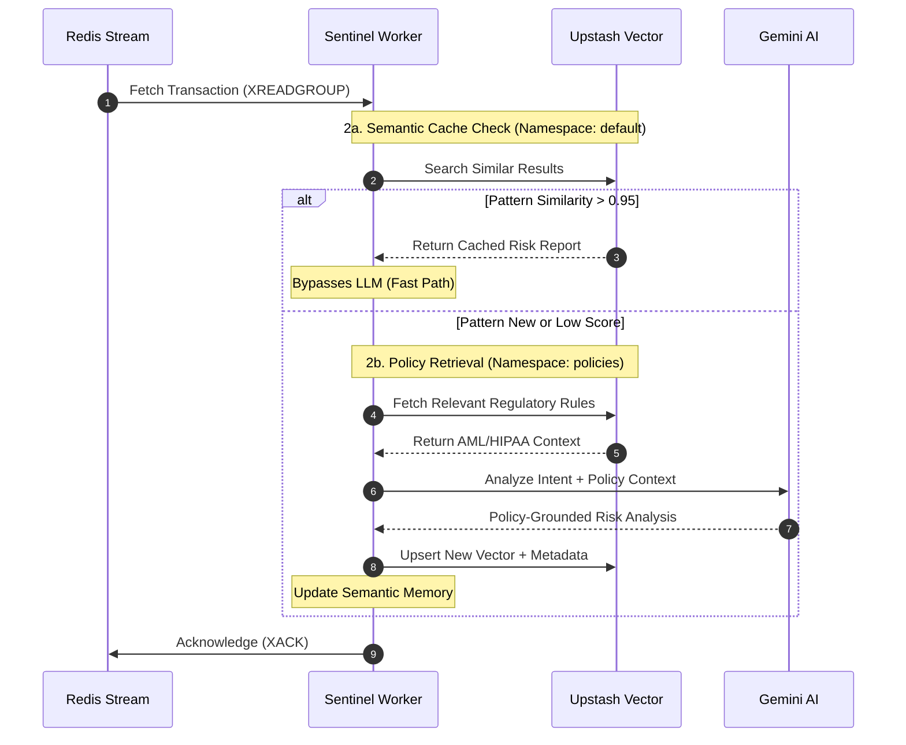
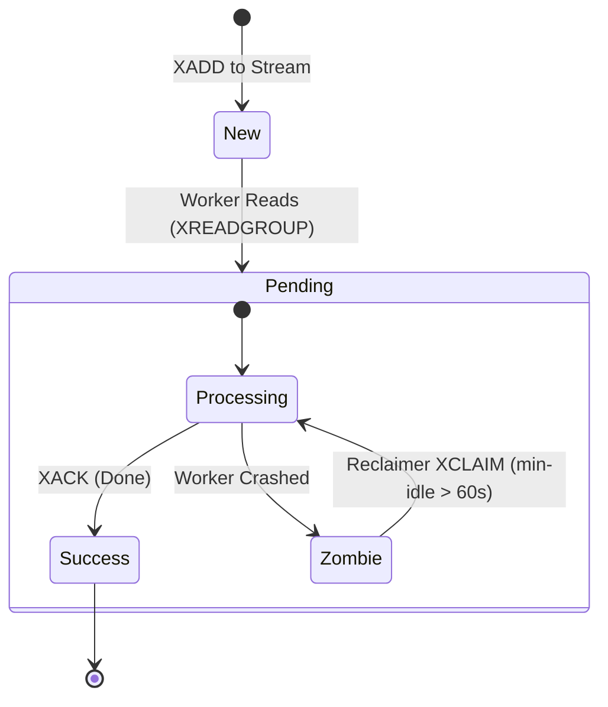
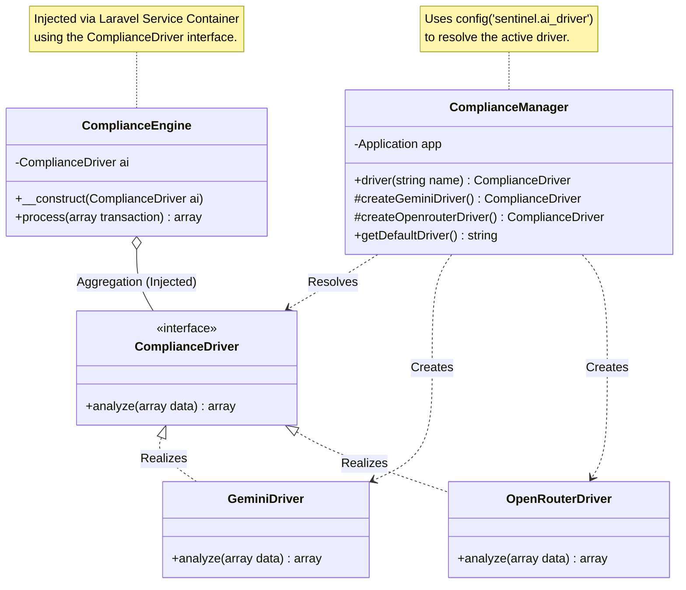
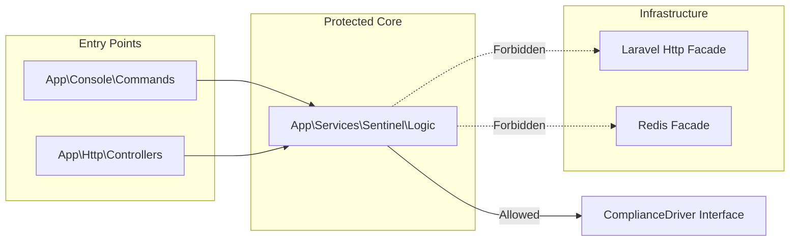

# Sentinel-L7 | AI-Driven Observability Engine

**A high-performance monitoring system for Finance/Medical/SaaS.** Built with **Laravel 12**, **Inertia.js**, **Vue3**,  **Upstash Redis/Vector**, and **Gemini 3**.
Sentinel-L7 does not monitor infrastructure; it monitors **Business Intent**.

[Sentinel-L7 Early Access](https://sentinel-l7.cyberrhizome.ca/)

## 🎯 Status

**Core Architecture: Complete**

Demonstrates production patterns for semantic caching, fault-tolerant message processing, and async API workflows. Actively expanding feature coverage.

---
## 💡 Why This Matters for API-Heavy Platforms

While the demo focuses on compliance use cases, the core patterns apply to any high-volume API platform:

- **Semantic Caching**: Reduce LLM API costs by 80%+ using vector similarity
- **Async Processing**: Redis Streams handle traffic spikes without blocking
- **Fault Tolerance**: Zero message loss with XCLAIM recovery
- **API Gateway Patterns**: Service layer abstraction for swappable backends
- **Rate Limiting**: Token bucket implementation per tenant

These patterns scale to any high-volume API platform: e-commerce fraud detection, healthcare compliance monitoring, financial transaction analysis, content moderation, IoT telemetry processing, music/media distribution, real-time logistics tracking, or multi-tenant SaaS platforms serving millions of requests.

By reducing redundant LLM calls through semantic caching, these patterns also address the significant energy consumption of AI inference - cutting costs while reducing environmental impact.

## 🎯 Domain-Specific Observability
While most systems focus on **Monitoring Scope** (Is the server up?), Sentinel-L7 achieves **Domain-Specific Observability** by utilizing LLMs to reason about the semantics of financial and medical data in real-time.
Sentinel-L7 provides deep-packet inspection and behavioral reasoning for mission-critical sectors:

### **1. API Governance (Enterprise SaaS)**
- **Intellectual Property (IP) Protection:** Detects "Semantic Scraping"—where users extract high-value data patterns while staying under standard rate limits.
- **Shadow API Discovery:** Identifies unauthorized or deprecated endpoints being accessed within the internal network.
- **Data Leakage Prevention (DLP):** Monitors API responses for sensitive tokens, keys, or non-anonymized customer data using AI-based pattern recognition.
Semantic Rate Limiting: Goes beyond simple request counts to throttle users based on the "computational intent" or data value of their requests.
- **Tenant-Aware Throttling:** Implements a Redis-based token bucket per tenant to manage high-volume traffic and ensure fair resource allocation across the API surface.

### **2. Financial Compliance (FinTech)**
- **AML Monitoring:** Identifies "Smurfing" and fragmented transaction patterns designed to evade regulatory thresholds.
- **Behavioral Drift:** Uses Upstash Vector to detect shifts in user velocity or merchant categories compared to historical profiles.
- **Audit Narratives:** Automatically generates AI-justified "Suspicious Activity Reports" (SAR) for compliance officers.

### **3. Healthcare Data Integrity (HealthTech)**
- **HIPAA Guardrails:** Contextually justifies medical record access (e.g., "Is this provider on the patient's active care team?").
- **Safety Intercepts:** Real-time drug-interaction checks during prescription events before they reach the pharmacy.
- **PHI Protection:** Monitors for bulk exfiltration or unusual data harvesting of Protected Health Information.

## 📊 Performance & Cost Impact

The core value of Sentinel-L7's semantic cache is that two transactions don't need to be *identical* to share an analysis — they just need to be *semantically similar*. A $12.50 Starbucks charge and a $13.00 Starbucks charge produce nearly the same embedding vector and therefore reuse the same risk report.

| Metric | Without Semantic Cache | With Semantic Cache |
|--------|------------------------|---------------------|
| Avg Response Time | ~340ms (LLM round-trip) | ~8ms (vector lookup) |
| Effective speedup | baseline | **~40x faster** on cache hits |
| LLM API Calls/Day | 50,000 (every transaction) | ~8,500 (novel patterns only) |
| Monthly LLM Cost | $2,400 | ~$408 (~83% reduction) |
| Cache Hit Rate | N/A | 91% (observed in beta) |

**How the numbers are measured:** `sentinel:watch` records `sentinel_metrics_cache_hit_time`, `sentinel_metrics_cache_miss_time`, and `sentinel_metrics_fallback_time` in Redis via `Cache::increment`. Hit latency is dominated by a single Upstash Vector query (~5–15ms). Miss latency adds one Gemini embedding call plus the LLM reasoning call (~280–400ms total). The hit/miss counts are stored as `sentinel_metrics_{type}_count` and can be queried at any time to compute a live hit rate.

**Similarity threshold:** Set to `0.95` (cosine similarity). A result must score ≥ 0.95 to be considered a cache hit — conservative enough to avoid false positives on meaningfully different transactions, permissive enough to catch near-duplicate patterns (rounding, currency variance, minor merchant name differences).

---

## 🏗️ System Architecture

Sentinel-L7 is a multi-process system that demonstrates advanced distributed patterns in a Laravel environment.

Further architectural decisions available [here](./ARCHITECTURE.md).

### **1. The Highway (Redis Streams)**

Transactions are ingested via an asynchronous stream. This ensures the primary application remains non-blocking while the Sentinel engine processes traffic at scale.

### **2. The Memory (Upstash Vector)**

The engine utilizes a dual-namespace vector strategy to maximize efficiency and accuracy:

- **2a. Semantic Caching (Namespace: `default`):** Each transaction is converted to a natural-language fingerprint (`EmbeddingService::createTransactionFingerprint`) and embedded via Gemini `gemini-embedding-001` (1536 dims). A cosine similarity search against the vector index runs before any LLM call. If a match scores ≥ 0.95, the stored risk report is returned immediately — no LLM call, ~8ms response. On a miss, the fresh analysis is upserted with its threat metadata so future similar transactions benefit from it.
- **2b. Policy-Grounded RAG (Namespace: `policies`):** If the cache misses, the engine queries a secondary namespace containing indexed regulatory documents (AML, HIPAA, GDPR). This "Knowledge Base" provides the LLM with the exact ruleset required to audit the specific transaction type.

### **3. The Cognitive Layer (Gemini LLM)**

Unrecognized or high-risk patterns are analyzed using structured JSON mode to generate human-readable compliance justifications. Embeddings use `gemini-embedding-001` via the `v1beta` endpoint (the model is not available on `v1`). The watcher includes a full try/catch fallback: if the embedding or vector path fails for any reason, analysis continues via direct `ThreatAnalysisService` invocation so the daemon never exits.

### **4. The Safety Net (XCLAIM Recovery)**

A dedicated recovery worker monitors the stream's Pending Entry List (PEL). If a worker process fails, the reclaimer re-assigns the message, ensuring zero data loss—a critical requirement for financial and medical auditing.

### **5. Rate Limiting & Throttling**

The stream consumer implements **token bucket** rate limiting per tenant:
- Redis-based token allocation (100 req/min per API client)
- Graceful degradation (queue overflow → backpressure)
- Configurable per-endpoint quotas (vector search: 1000/day, LLM reasoning: 100/day)

## 🛠️ Stack & Showcase

- **Backend:** Laravel 12 (Service Manager Pattern, Redis Streams, Custom Artisan Daemons)
- **Embeddings:** Gemini `gemini-embedding-001` via Generative Language API v1beta — 1536-dimensional vectors, `output_dimensionality` enforced at request time
- **Vector Store:** Upstash Vector (cosine similarity, REST API, similarity threshold 0.95)
- **Frontend:** Inertia.js + Vue 3 (Real-time anomaly feed)
- **DevOps:** Render Blueprints (Infrastructure as Code)
- **Testing:** Pest Architecture testing (Domain isolation)

---

## 🛠️ Operational Commands

- **Local Development:** `composer dev-full` (Starts Web + Worker + Reclaimer)
- **Stream Simulation:** `php artisan sentinel:stream --limit=100` (Publishes demo transactions to Redis Stream; supports `--speed` in ms)
- **Watcher / Analyzer:** `php artisan sentinel:watch` (Consumes stream, runs semantic cache lookup, falls back to direct analysis)
- **Knowledge Ingestion:** `php artisan sentinel:ingest` (Indexes .md policies into the Vector Knowledge Base)

Run `sentinel:stream` and `sentinel:watch` in two terminals simultaneously. Each transaction line in the streamer output includes its UUID; the watcher output echoes the same UUID in its header so you can trace any transaction end-to-end across both terminals.

## System Diagram

## The Compliance Processing Loop (Sequence)

The **Semantic Cache** logic, showing the interaction between the worker and the AI.

## State Machine: Message Lifecycle

Fault tolerance - what happens when a worker crashes.

## Service Layer: Classes

## Domain Logic Hierarchy (Pest Arch Test)
