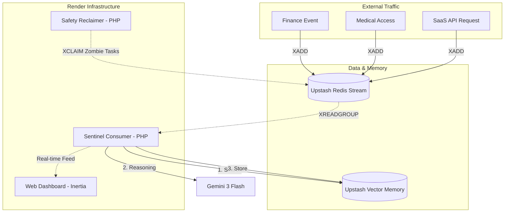
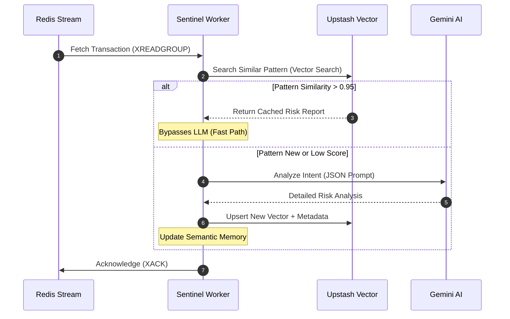
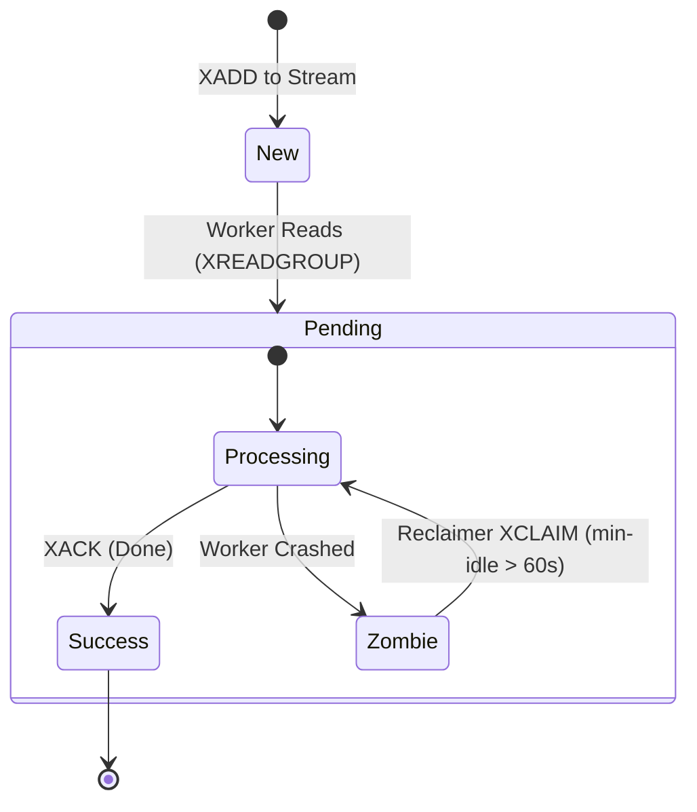
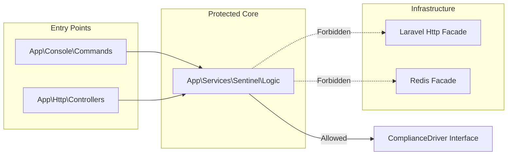

# Sentinel-L7 | AI-Driven Observability Engine

**A high-performance monitoring system for Finance/Medical/SaaS.** Built with **Laravel 12**, **Inertia.js**, **Upstash Redis/Vector**, and **Gemini 3 Flash**.
Sentinel-L7 does not monitor infrastructure; it monitors **Business Intent**.

---

## Status
🚧 Coming Soon!

---

## 🎯 Domain-Specific Observability
While most systems focus on **Monitoring Scope** (Is the server up?), Sentinel-L7 achieves **Domain-Specific Observability** by utilizing LLMs to reason about the semantics of financial and medical data in real-time.
Sentinel-L7 provides deep-packet inspection and behavioral reasoning for mission-critical sectors:

### **1. Financial Compliance (FinTech)**
- **AML Monitoring:** Identifies "Smurfing" and fragmented transaction patterns designed to evade regulatory thresholds.
- **Behavioral Drift:** Uses Upstash Vector to detect shifts in user velocity or merchant categories compared to historical profiles.
- **Audit Narratives:** Automatically generates AI-justified "Suspicious Activity Reports" (SAR) for compliance officers.

### **2. Healthcare Data Integrity (HealthTech)**
- **HIPAA Guardrails:** Contextually justifies medical record access (e.g., "Is this provider on the patient's active care team?").
- **Safety Intercepts:** Real-time drug-interaction checks during prescription events before they reach the pharmacy.
- **PHI Protection:** Monitors for bulk exfiltration or unusual data harvesting of Protected Health Information.

### **3. API Governance (Enterprise SaaS)**
- **Intellectual Property (IP) Protection:** Detects "Semantic Scraping"—where users extract high-value data patterns while staying under standard rate limits.
- **Shadow API Discovery:** Identifies unauthorized or deprecated endpoints being accessed within the internal network.
- **Data Leakage Prevention (DLP):** Monitors API responses for sensitive tokens, keys, or non-anonymized customer data using AI-based pattern recognition.

---

## 🏗️ System Architecture

Sentinel-L7 is a multi-process system that demonstrates advanced distributed patterns in a Laravel environment.

### **1. The Highway (Redis Streams)**

Transactions are ingested via an asynchronous stream. This ensures the primary application remains non-blocking while the Sentinel engine processes traffic at scale.

### **2. The Memory (Upstash Vector)**

The engine utilizes **Semantic Caching**. Before invoking the LLM, the system performs a sub-50ms vector similarity search. If a similar transaction pattern was previously analyzed, the engine reuses the existing risk report, drastically reducing latency and API costs.

### **3. The Cognitive Layer (Gemini 3 Flash)**

Unrecognized or high-risk patterns are analyzed by Gemini 3 Flash using structured JSON mode to generate human-readable compliance justifications.

### **4. The Safety Net (XCLAIM Recovery)**

A dedicated recovery worker monitors the stream's Pending Entry List (PEL). If a worker process fails, the reclaimer re-assigns the message, ensuring zero data loss—a critical requirement for financial and medical auditing.

---

## 🛠️ Stack & Showcase

- **Backend:** Laravel 12 (Service Manager Pattern, Redis Streams, Custom Artisan Daemons)
- **Frontend:** Inertia.js + Vue 3 (Real-time anomaly feed)
- **DevOps:** Render Blueprints (Infrastructure as Code)
- **Testing:** Pest Architecture testing (Domain isolation)

---

### 🚀 One-Command Launch

Bash

```
# Start all micro-services locally
composer dev-full
```

## System Diagram

## The Compliance Processing Loop (Sequence)

The **Semantic Cache** logic, showing the interaction between the worker and the AI.

Code snippet



## State Machine: Message Lifecycle

Fault tolerance - what happens when a worker crashes.



## Domain Logic Hierarchy (Pest Arch Test)
