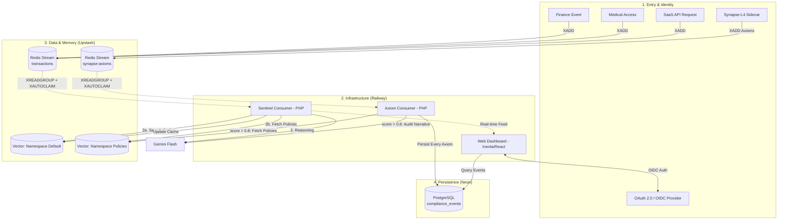
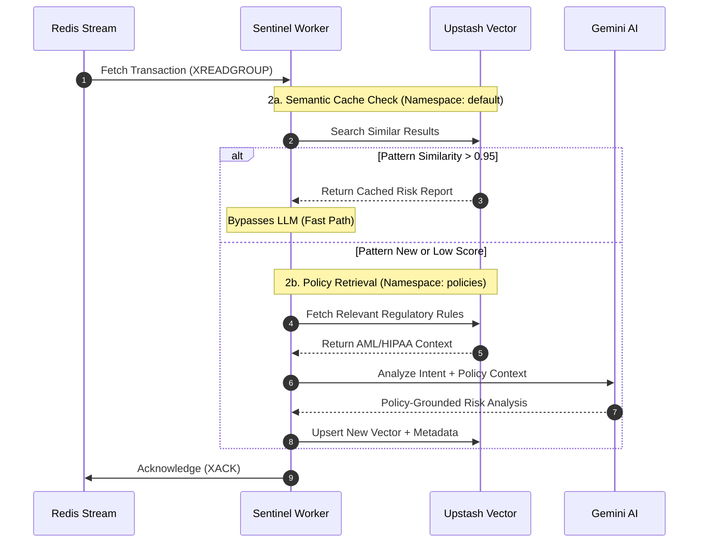
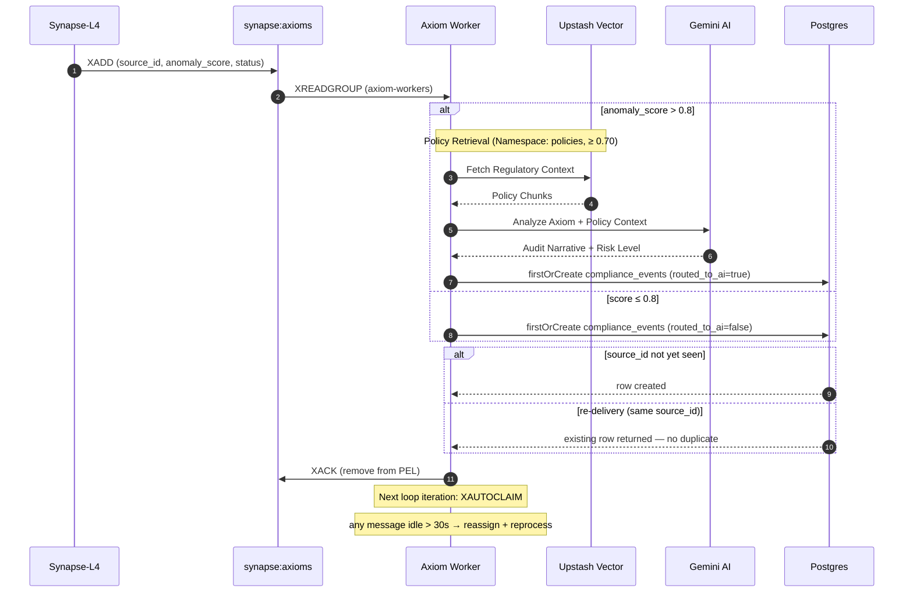
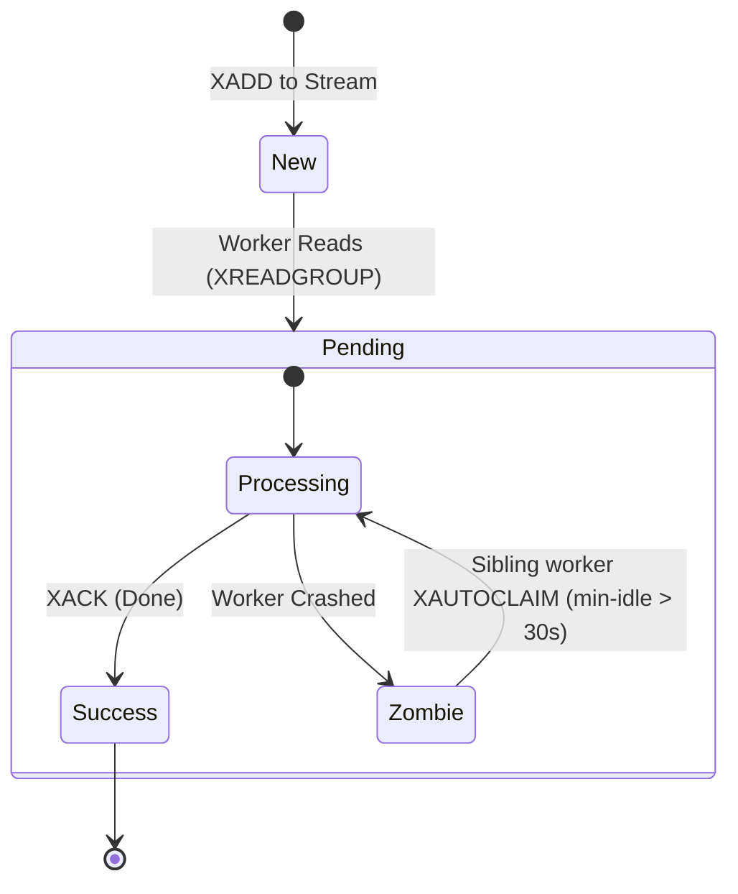
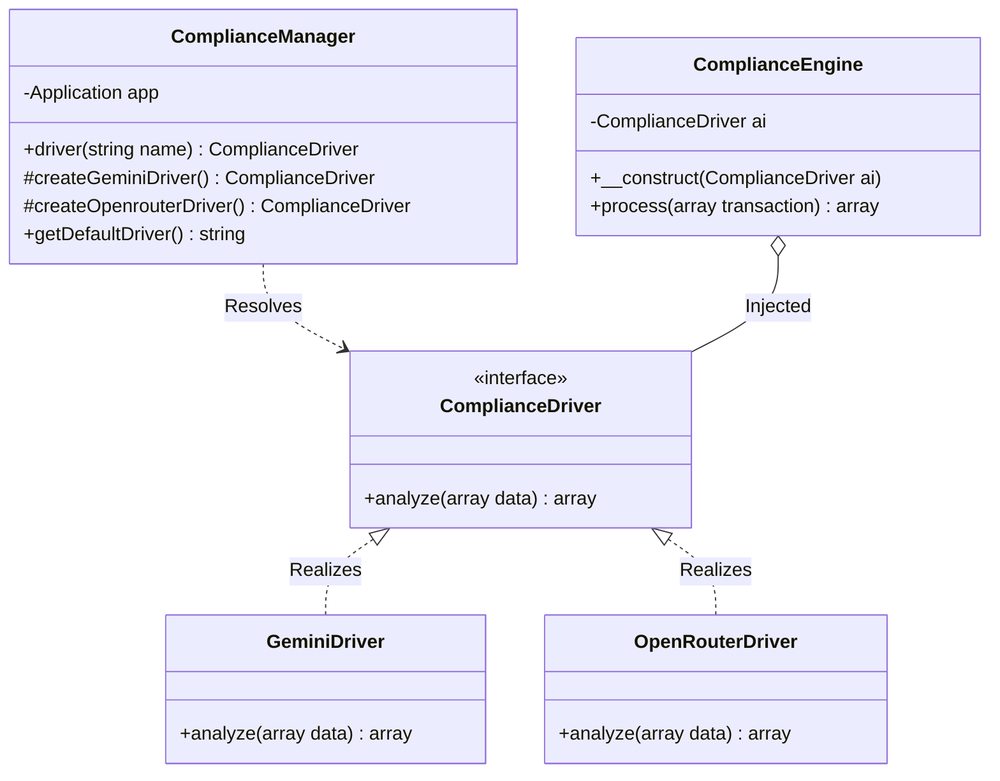
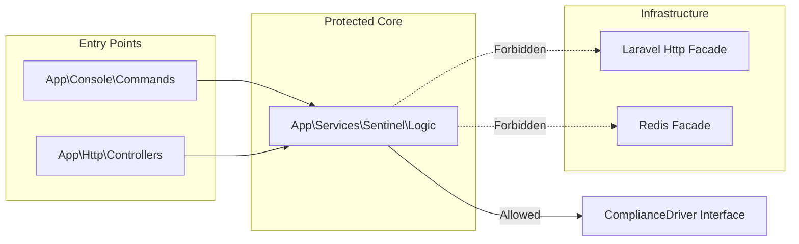

# Sentinel-L7

A multi-process Laravel application built to explore production patterns for async message processing, semantic caching, and fault-tolerant distributed systems — using a financial compliance engine as the domain.

🌐 **Early Signup:** https://sentinel-l7.cyberRhizome.ca/

---

## 🎯 What this is

I built this to get hands-on with a few specific problems:

- **Async ingestion without blocking** — how do you absorb traffic spikes while keeping the web process responsive?
- **Reducing LLM costs at scale** — vector similarity as a cache layer before you ever hit the model
- **Fault tolerance in a worker process** — what happens when a worker crashes mid-job?
- **Clean architecture under Laravel** — keeping domain logic decoupled from infrastructure

The compliance/AML domain gave these problems real shape. The input isn't limited to financial transactions — data can come from anywhere: financial events, medical access logs, SaaS API activity, or raw system telemetry. The [Synapse-L4](https://github.com/obrienma/synapse-l4) sidecar handles the [EventHorizon telemetry](https://github.com/obrienma/EventHorizon) path: it validates raw events through an LLM judge pass and emits typed, scored Axioms into the pipeline. Sentinel-L7 doesn't care about the source — it cares about whether the data exceeds a risk threshold and what the applicable policy says. That determination is grounded in a corpus of domain-specific policy documents indexed into a vector knowledge base (Upstash Vector, `policies` namespace), retrieved at analysis time by semantic similarity and filtered by domain tag. The AI prompt templates that drive analysis are version-controlled in `prompts/` — each carries a version number, a changelog, and the list of drivers that use it, so prompt drift is visible in the same way as code drift.

📋[User Stories](docs/USER_STORIES.md) — compliance officer, platform engineer, AI agent

---


## 📊 Status

- [x] Core pipeline — Redis Streams, semantic cache, fault tolerance (XCLAIM)
- [x] React 19 + shadcn/ui dashboard with live transaction feed
- [x] MCP server (analyze_transaction, search_policies, get_recent_transactions)
- [x] ComplianceDriver stack — GeminiDriver (Gemini Flash + policy RAG), OpenRouterDriver (OpenAI-compatible, swap via env), ComplianceManager
- [x] Synapse-L4 Axiom ingestion — `synapse:axioms` Redis stream + `sentinel:watch-axioms` worker
- [x] `compliance_events` audit trail — Postgres persistence with `source_id` correlation
- [x] Policy RAG — `sentinel:ingest` chunking pipeline, `policies/` corpus, score-aware query formulation
- [x] Domain-scoped RAG retrieval — `domain` metadata tag at ingest; server-side filter at query time; retrieval quality logging
- [x] Output quality scoring — 4-signal rubric on every compliance driver response; `low quality score` warning when score ≤ 1
- [x] Retrieval coverage logging — `mean_score` and `under_indexed` per RAG query; `Log::warning` fires when a domain filter returns < 2 chunks
- [x] Synapse-L4 Python sidecar — FastAPI LLM judge pass + Redis emitter
- [x] Compliance dashboard — Flags / Events nav pages surfacing `compliance_events`
- [x] XCLAIM recovery for `synapse:axioms` consumer group — `sentinel:reclaim-axioms` command
- [x] Transaction history — processed transactions persisted to Postgres `transactions` table
- [x] Idempotent Axiom persistence — `firstOrCreate` + partial unique index on `source_id` + `UniqueConstraintViolationException` catch; re-delivered stream messages never produce duplicate `compliance_events` rows
- [x] Backpressure step 1 — `XREAD COUNT 1` on transaction stream + `XLEN` producer guard (`sentinel.backpressure.publish_pause_threshold`, default 800) pauses `sentinel:stream` when depth exceeds the threshold
- [x] Backpressure step 2 — XREADGROUP + XAUTOCLAIM self-healing worker pool (ADR-0022): transaction stream migrated to consumer group `sentinel-consumers`; `XAUTOCLAIM` embedded at the top of each worker loop; dead-letter guard ACKs poison messages at `delivery_count >= 3`; dedicated `sentinel:reclaim-axioms` daemon removed
- [x] Backpressure step 3 — graduated consumer lag signal (ADR-0023): worker writes `XPENDING` count to `sentinel:consumer_lag` (TTL 10s) after every `readGroup` cycle; producer applies soft-limit sleep (500ms, configurable) at lag > 50, spin-wait at lag > 200
- [x] HTTP rate limiting — named `RateLimiter::for()` limiters on login (5/min per IP), signup (10/hr per IP), and `/dashboard/stream` (20/min per authenticated user); all thresholds config-backed via `RATE_LIMIT_*` env vars
- [x] Early-exit idempotency in `AxiomProcessorService` — `EXISTS` check on `source_id` before AI routing; duplicate re-deliveries short-circuit before Gemini is called; DB-layer `firstOrCreate` remains as concurrent-race fallback
- [x] Compliance report CSV export — `GET /compliance/export` streams flagged/all events chunked at 500 rows; optional `from`/`to` date filters; UI date-range picker on the Compliance page
- [x] Backpressure dashboard widget — consumer lag stat card reads `sentinel:consumer_lag` (10s TTL); colour-coded emerald/amber/red against `lag_warn`/`lag_pause` config thresholds; dash when worker is offline
- [x] OTel instrumentation (Phase 2) — `OtelServiceProvider` bootstraps SDK (BatchSpanProcessor → OTLP HTTP); `AxiomProcessorService` wraps processing in wide spans with `source_id`, `anomaly_score`, `domain`, `routed_to_ai` attributes; `traceparent` extracted from stream entries to continue Synapse-L4 trace as child span (ADR-0024)

---

## 🛠️ Stack

| Layer | Technology |
|---|---|
| Backend | Laravel 12, PHP |
| Frontend | Inertia.js + React 19 + shadcn/ui |
| Async | Redis Streams (Upstash) |
| Vector store | Upstash Vector |
| AI | Gemini Flash (swappable via driver abstraction) |
| MCP | Laravel MCP — exposes tools to AI agents via Model Context Protocol |
| DevOps | Docker, Railway (IaC) |
| Testing | Pest + architecture tests |

---

## 🏗️ Architecture

### Async ingestion (Redis Streams)

Events are written to a Redis Stream via `XADD` and consumed by a dedicated worker process using `XREADGROUP`. The web process never blocks waiting for analysis to complete — it just writes to the stream and returns.

### Semantic caching (dual-namespace vector strategy)

Before invoking the LLM, the worker performs a sub-50ms vector similarity search against a cache namespace. If similarity exceeds 0.95, the existing result is returned — no model call needed. This cuts LLM costs by 80%+ on repeat or near-repeat patterns.

Cache entries carry a **policy epoch** — an md5 hash of the policy corpus stamped when `sentinel:ingest` runs. On every cache hit, the stored epoch is checked against the current epoch. A mismatch discards the cached verdict and forces re-analysis, ensuring no compliance ruling survives a policy update without being re-examined against the new documents.

On a cache miss, a second namespace containing indexed regulatory policy documents (AML, HIPAA, GDPR) is queried for grounded context. Each policy chunk carries a `domain` metadata tag stamped at ingest time (`aml`, `gdpr`, `hipaa`, …). When a compliance domain is known for the event being analyzed, the query is scoped to that domain via a server-side metadata filter — preventing GDPR chunks from grounding an AML analysis and vice versa. A zero-chunk filtered retrieval is logged explicitly, making silent partial failures visible.

### Fault tolerance (XAUTOCLAIM self-healing pool)

Both worker processes (`sentinel:watch`, `sentinel:watch-axioms`) consume their streams via `XREADGROUP`, so unacknowledged messages sit in the Pending Entry List until `XACK`'d. At the top of every loop iteration the worker first runs `XAUTOCLAIM` against the PEL — any message idle longer than `sentinel.reclaim.idle_ms` (default 30s) is reassigned to the current worker and reprocessed. Recovery is distributed across the pool: losing a worker doesn't stop recovery, since any other running worker claims orphaned messages on its next cycle. A delivery-count guard ACKs poison messages at `delivery_count >= 3` (logged as a structured `Log::error`) so a message that reliably crashes its consumer cannot circulate indefinitely. See ADR-0022.

### Axiom ingestion (Synapse-L4 → Postgres audit trail)

Validated Axioms from the Synapse-L4 sidecar arrive on a dedicated `synapse:axioms` Redis stream. A separate worker (`sentinel:watch-axioms`) consumes them independently of the transaction pipeline using `XREADGROUP` — messages sit in the Pending Entry List until explicitly `XACK`'d after successful processing. Every Axiom is persisted to Postgres (`compliance_events`) regardless of score — no silent drops. When `anomaly_score > 0.8`, the worker fetches relevant policy context from the `policies` vector namespace and sends the Axiom to Gemini Flash for an AI-generated audit narrative. The compliance dashboard surfaces these events with narratives, risk levels, and `source_id` correlation back to EventHorizon.

Persistence is idempotent: `compliance_events` carries a partial unique index on `source_id` (excluding the `'unknown'` sentinel for malformed Axioms), and the worker uses `firstOrCreate` keyed on `source_id`. If two workers race on the same re-delivered message and both attempt INSERT simultaneously, the second hits the unique constraint; the worker catches `UniqueConstraintViolationException` and treats it as a successful no-op before calling `XACK`. This guarantees exactly-once persistence even under `XAUTOCLAIM` recovery.

### AI driver abstraction (Service Manager pattern)

The AI backend is resolved through a `ComplianceManager` that extends Laravel's `Manager` class. Swapping from Gemini to OpenRouter (or any other backend) is a config change, not a code change. The domain logic only ever depends on the `ComplianceDriver` interface.

### MCP server (Model Context Protocol)

Sentinel exposes an MCP endpoint at `POST /mcp` that lets AI agents (Claude Desktop, Cursor, etc.) call into the compliance pipeline as tools. Three tools are registered:

| Tool | What it does |
|---|---|
| `analyze_transaction` | Runs the full compliance pipeline — semantic cache check, then AML/GDPR/HIPAA analysis |
| `search_policies` | Semantic search over the indexed regulatory policy knowledge base (ns:policies, ≥0.70) |
| `get_recent_transactions` | Returns the live Redis feed of recently processed transactions |

This lets an LLM look up applicable rules *before* deciding how to analyze a transaction — the multi-hop retrieval pattern that static RAG can't do.

### Domain isolation (enforced by architecture tests)

Pest architecture tests assert that the core domain layer (`App\Services\Sentinel\Logic`) cannot directly import Laravel's `Http` or `Redis` facades. Infrastructure access goes through the contract layer. If someone breaks this boundary, the test suite catches it.

---

## 📐 Diagrams

### System Overview


```mermaid
graph TB
    subgraph "1. Entry & Identity"
        T1[Finance Event]
        T2[Medical Access]
        T3[SaaS API Request]
        SL4[Synapse-L4 Sidecar]
        IdP[OAuth 2.0 / OIDC Provider]
    end

    subgraph "2. Infrastructure (Railway)"
        Web[Web Dashboard - Inertia/React]
        Worker[Sentinel Consumer - PHP]
        AxiomWorker[Axiom Consumer - PHP]
    end

    subgraph "3. Data & Memory (Upstash)"
        Stream[(Redis Stream\ntransactions)]
        AxiomStream[(Redis Stream\nsynapse:axioms)]
        VectorCache[(Vector: Namespace Default)]
        VectorRules[(Vector: Namespace Policies)]
    end

    subgraph "4. Persistence (Neon)"
        PG[(PostgreSQL\ncompliance_events)]
    end

    Web <-->|OIDC Auth| IdP
    T1 & T2 & T3 -->|XADD| Stream
    SL4 -->|XADD Axioms| AxiomStream
    Stream -.->|XREADGROUP + XAUTOCLAIM| Worker
    AxiomStream -.->|XREADGROUP + XAUTOCLAIM| AxiomWorker
    Worker -->|2a. Search Cache| VectorCache
    Worker -->|2b. Fetch Policies| VectorRules
    Worker -->|3. Reasoning| AI[Gemini Flash]
    Worker -.->|Real-time Feed| Web
    Worker -->|Update Cache| VectorCache
    AxiomWorker -->|score > 0.8: Fetch Policies| VectorRules
    AxiomWorker -->|score > 0.8: Audit Narrative| AI
    AxiomWorker -->|Persist Every Axiom| PG
    Web -->|Query Events| PG
```

### Processing Loop


```mermaid
sequenceDiagram
    autonumber
    participant S as Redis Stream
    participant W as Sentinel Worker
    participant V as Upstash Vector
    participant G as Gemini AI

    S->>W: Fetch Transaction (XREADGROUP)

    note over W,V: 2a. Semantic Cache Check (Namespace: default)
    W->>V: Search Similar Results

    alt Pattern Similarity > 0.95
        V-->>W: Return Cached Risk Report
        Note over W: Bypasses LLM (Fast Path)
    else Pattern New or Low Score
        note over W,V: 2b. Policy Retrieval (Namespace: policies)
        W->>V: Fetch Relevant Regulatory Rules
        V-->>W: Return AML/HIPAA Context
        W->>G: Analyze Intent + Policy Context
        G-->>W: Policy-Grounded Risk Analysis
        W->>V: Upsert New Vector + Metadata
    end

    W->>S: Acknowledge (XACK)
```

### Axiom Ingestion (Synapse-L4 → Compliance Events)


```mermaid
sequenceDiagram
    autonumber
    participant SL4 as Synapse-L4
    participant AS as synapse:axioms
    participant AW as Axiom Worker
    participant V as Upstash Vector
    participant G as Gemini AI
    participant DB as Postgres

    SL4->>AS: XADD (source_id, anomaly_score, status)
    AS->>AW: XREADGROUP (axiom-workers)

    alt anomaly_score > 0.8
        note over AW,V: Policy Retrieval (Namespace: policies, ≥ 0.70)
        AW->>V: Fetch Regulatory Context
        V-->>AW: Policy Chunks
        AW->>G: Analyze Axiom + Policy Context
        G-->>AW: Audit Narrative + Risk Level
        AW->>DB: firstOrCreate compliance_events (routed_to_ai=true)
    else score ≤ 0.8
        AW->>DB: firstOrCreate compliance_events (routed_to_ai=false)
    end

    alt source_id not yet seen
        DB-->>AW: row created
    else re-delivery (same source_id)
        DB-->>AW: existing row returned — no duplicate
    end

    AW->>AS: XACK (remove from PEL)

    note over AW: Next loop iteration: XAUTOCLAIM
    note over AW: any message idle > 30s → reassign + reprocess
```

### Message Lifecycle (Fault Tolerance)


```mermaid
stateDiagram-v2
    [*] --> New: XADD to Stream
    New --> Pending: Worker Reads (XREADGROUP)

    state Pending {
        [*] --> Processing
        Processing --> Success: XACK (Done)
        Processing --> Zombie: Worker Crashed
    }

    Zombie --> Processing: Sibling worker XAUTOCLAIM (min-idle > 30s)
    Success --> [*]
```

### Service Layer


```mermaid
classDiagram
    direction TB

    class ComplianceDriver {
        <<interface>>
        +analyze(array data) array
    }

    class GeminiDriver {
        +analyze(array data) array
    }

    class OpenRouterDriver {
        +analyze(array data) array
    }

    class ComplianceManager {
        -Application app
        +driver(string name) ComplianceDriver
        #createGeminiDriver() ComplianceDriver
        #createOpenrouterDriver() ComplianceDriver
        +getDefaultDriver() string
    }

    class ComplianceEngine {
        -ComplianceDriver ai
        +__construct(ComplianceDriver ai)
        +process(array transaction) array
    }

    ComplianceDriver <|.. GeminiDriver : Realizes
    ComplianceDriver <|.. OpenRouterDriver : Realizes
    ComplianceManager ..> ComplianceDriver : Resolves
    ComplianceEngine o-- ComplianceDriver : Injected
```

### Domain Logic Hierarchy


```mermaid
graph LR
    subgraph "Protected Core"
        Domain[App\Services\Sentinel\Logic]
    end

    subgraph "Infrastructure"
        Http[Laravel Http Facade]
        Redis[Redis Facade]
    end

    subgraph "Entry Points"
        Web[App\Http\Controllers]
        Console[App\Console\Commands]
    end

    Console --> Domain
    Web --> Domain
    Domain -.->|Forbidden| Http
    Domain -.->|Forbidden| Redis
    Domain -->|Allowed| Contract[ComplianceDriver Interface]
```

---

## 🚀 Running locally

```bash
# Start dashboard dev (web + queue + logs + vite + axioms worker)
composer dev

# Run a batch through the stream manually (Ctrl-C / SIGTERM exits cleanly)
php artisan sentinel:stream --limit=100

# Index policy documents into the vector knowledge base (bumps policy epoch, cold-starts cache)
php artisan sentinel:ingest

# Reset dashboard metrics counters
php artisan sentinel:reset-metrics
```

---

## 🗺️ What's still ahead

- **OTel Phase 3** — EventHorizon instrumentation (four-stage RabbitMQ trace, malformed-message span events)
- **EventHorizon deep-link** — `source_id` correlation from compliance event back to the originating EventHorizon event
- **Silent partial failure alerting** — wire `under_indexed` warnings and `quality_score` logs to an active alert (e.g. N consecutive under-indexed queries on domain X, or `quality_score=0` for N consecutive events)
- **OAuth on the MCP endpoint** — `Mcp::oauthRoutes()` before production agent access
- **CI pipeline** — architecture tests + unit suite running on every push
- **End-to-end idempotency audit** — verify EventHorizon event ID flows through Synapse-L4 as `source_id` on the Axiom (early-exit dedup in `AxiomProcessorService` is done; source_id provenance through the full chain is not yet verified)

