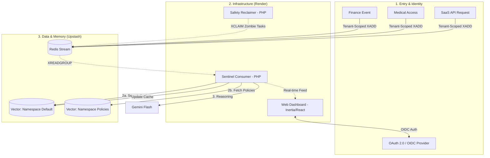
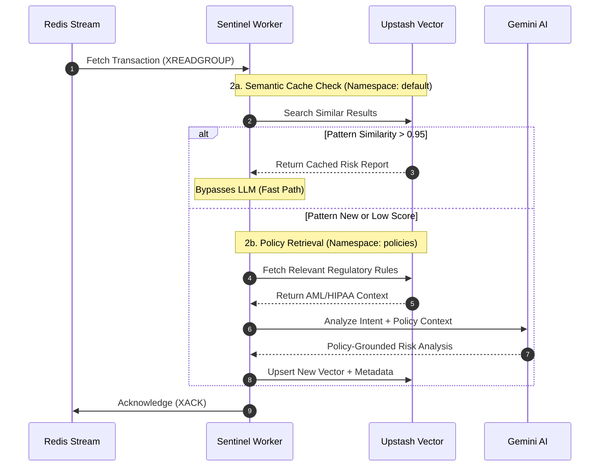
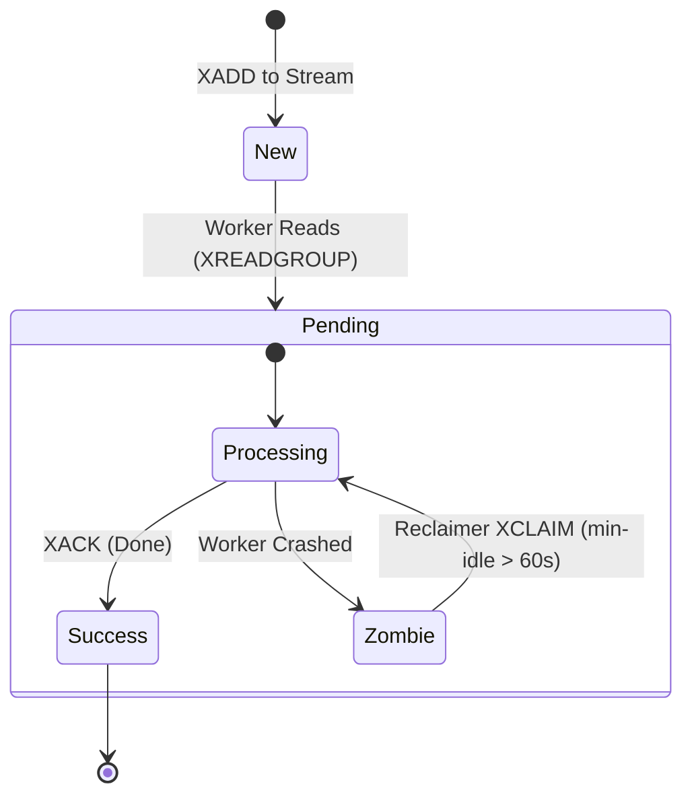
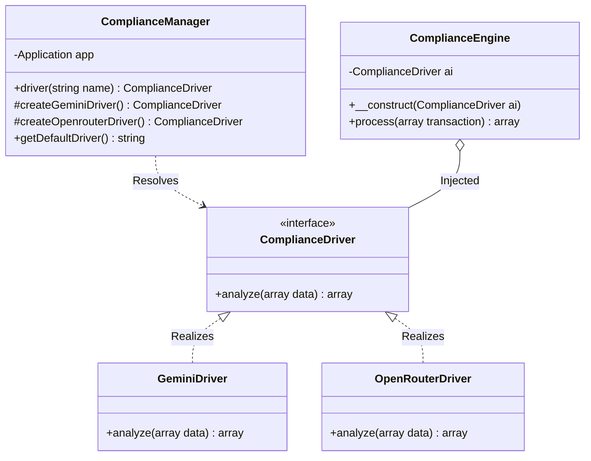
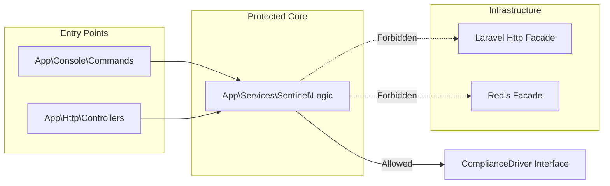

# Sentinel-L7

A multi-process Laravel application built to explore production patterns for async message processing, semantic caching, and fault-tolerant distributed systems — using a financial compliance engine as the domain.

🌐 **Early Signup:** https://sentinel-l7.cyberrhizome.ca/

---

## 🎯 What this is

I built this to get hands-on with a few specific problems:

- **Async ingestion without blocking** — how do you absorb traffic spikes while keeping the web process responsive?
- **Reducing LLM costs at scale** — vector similarity as a cache layer before you ever hit the model
- **Fault tolerance in a worker process** — what happens when a worker crashes mid-job?
- **Clean architecture under Laravel** — keeping domain logic decoupled from infrastructure

The compliance/AML domain gave these problems real shape: financial transaction processing has hard reliability requirements, which made the design decisions feel meaningful rather than academic.

---

## 🛠️ Stack

| Layer | Technology |
|---|---|
| Backend | Laravel 12, PHP |
| Frontend | Inertia.js + React 19 + shadcn/ui |
| Async | Redis Streams (Upstash) |
| Vector store | Upstash Vector |
| AI | Gemini Flash (swappable via driver abstraction) |
| MCP | Laravel MCP — exposes tools to AI agents via Model Context Protocol |
| DevOps | Docker, Render Blueprints (IaC) |
| Testing | Pest + architecture tests |

---

## 🏗️ Architecture

### Async ingestion (Redis Streams)

Events are written to a Redis Stream via `XADD` and consumed by a dedicated worker process using `XREADGROUP`. The web process never blocks waiting for analysis to complete — it just writes to the stream and returns.

### Semantic caching (dual-namespace vector strategy)

Before invoking the LLM, the worker performs a sub-50ms vector similarity search against a cache namespace. If similarity exceeds 0.95, the existing result is returned — no model call needed. This cuts LLM costs by 80%+ on repeat or near-repeat patterns.

On a cache miss, a second namespace containing indexed regulatory policy documents (AML, HIPAA, GDPR) is queried to provide the model with grounded context before it reasons about the transaction.

### Fault tolerance (XCLAIM recovery)

A separate reclaimer process monitors the stream's Pending Entry List. If a worker crashes mid-processing, the reclaimer detects the idle message and re-assigns it via `XCLAIM`. Zero message loss.

### AI driver abstraction (Service Manager pattern)

The AI backend is resolved through a `ComplianceManager` that extends Laravel's `Manager` class. Swapping from Gemini to OpenRouter (or any other backend) is a config change, not a code change. The domain logic only ever depends on the `ComplianceDriver` interface.

### MCP server (Model Context Protocol)

Sentinel exposes an MCP endpoint at `POST /mcp` that lets AI agents (Claude Desktop, Cursor, etc.) call into the compliance pipeline as tools. Three tools are registered:

| Tool | What it does |
|---|---|
| `analyze_transaction` | Runs the full compliance pipeline — semantic cache check, then AML/GDPR/HIPAA analysis |
| `search_policies` | Semantic search over the indexed regulatory policy knowledge base (ns:policies, ≥0.70) |
| `get_recent_transactions` | Returns the live Redis feed of recently processed transactions |

This lets an LLM look up applicable rules *before* deciding how to analyze a transaction — the multi-hop retrieval pattern that static RAG can't do.

### Domain isolation (enforced by architecture tests)

Pest architecture tests assert that the core domain layer (`App\Services\Sentinel\Logic`) cannot directly import Laravel's `Http` or `Redis` facades. Infrastructure access goes through the contract layer. If someone breaks this boundary, the test suite catches it.

---

## 📐 Diagrams

### System Overview


```mermaid
graph TB
    subgraph "1. Entry & Identity"
        T1[Finance Event]
        T2[Medical Access]
        T3[SaaS API Request]
        IdP[OAuth 2.0 / OIDC Provider]
    end

    subgraph "2. Infrastructure (Render)"
        Web[Web Dashboard - Inertia/React]
        Worker[Sentinel Consumer - PHP]
        Reclaimer[Safety Reclaimer - PHP]
    end

    subgraph "3. Data & Memory (Upstash)"
        Stream[(Redis Stream)]
        VectorCache[(Vector: Namespace Default)]
        VectorRules[(Vector: Namespace Policies)]
    end

    Web <-->|OIDC Auth| IdP
    T1 & T2 & T3 -->|Tenant-Scoped XADD| Stream
    Stream -.->|XREADGROUP| Worker
    Worker -->|2a. Search Cache| VectorCache
    Worker -->|2b. Fetch Policies| VectorRules
    Worker -->|3. Reasoning| AI[Gemini Flash]
    Reclaimer -.->|XCLAIM Zombie Tasks| Stream
    Worker -.->|Real-time Feed| Web
    Worker -->|Update Cache| VectorCache
```

### Processing Loop


```mermaid
sequenceDiagram
    autonumber
    participant S as Redis Stream
    participant W as Sentinel Worker
    participant V as Upstash Vector
    participant G as Gemini AI

    S->>W: Fetch Transaction (XREADGROUP)

    note over W,V: 2a. Semantic Cache Check (Namespace: default)
    W->>V: Search Similar Results

    alt Pattern Similarity > 0.95
        V-->>W: Return Cached Risk Report
        Note over W: Bypasses LLM (Fast Path)
    else Pattern New or Low Score
        note over W,V: 2b. Policy Retrieval (Namespace: policies)
        W->>V: Fetch Relevant Regulatory Rules
        V-->>W: Return AML/HIPAA Context
        W->>G: Analyze Intent + Policy Context
        G-->>W: Policy-Grounded Risk Analysis
        W->>V: Upsert New Vector + Metadata
    end

    W->>S: Acknowledge (XACK)
```

### Message Lifecycle (Fault Tolerance)


```mermaid
stateDiagram-v2
    [*] --> New: XADD to Stream
    New --> Pending: Worker Reads (XREADGROUP)

    state Pending {
        [*] --> Processing
        Processing --> Success: XACK (Done)
        Processing --> Zombie: Worker Crashed
    }

    Zombie --> Processing: Reclaimer XCLAIM (min-idle > 60s)
    Success --> [*]
```

### Service Layer


```mermaid
classDiagram
    direction TB

    class ComplianceDriver {
        <<interface>>
        +analyze(array data) array
    }

    class GeminiDriver {
        +analyze(array data) array
    }

    class OpenRouterDriver {
        +analyze(array data) array
    }

    class ComplianceManager {
        -Application app
        +driver(string name) ComplianceDriver
        #createGeminiDriver() ComplianceDriver
        #createOpenrouterDriver() ComplianceDriver
        +getDefaultDriver() string
    }

    class ComplianceEngine {
        -ComplianceDriver ai
        +__construct(ComplianceDriver ai)
        +process(array transaction) array
    }

    ComplianceDriver <|.. GeminiDriver : Realizes
    ComplianceDriver <|.. OpenRouterDriver : Realizes
    ComplianceManager ..> ComplianceDriver : Resolves
    ComplianceEngine o-- ComplianceDriver : Injected
```

### Domain Logic Hierarchy


```mermaid
graph LR
    subgraph "Protected Core"
        Domain[App\Services\Sentinel\Logic]
    end

    subgraph "Infrastructure"
        Http[Laravel Http Facade]
        Redis[Redis Facade]
    end

    subgraph "Entry Points"
        Web[App\Http\Controllers]
        Console[App\Console\Commands]
    end

    Console --> Domain
    Web --> Domain
    Domain -.->|Forbidden| Http
    Domain -.->|Forbidden| Redis
    Domain -->|Allowed| Contract[ComplianceDriver Interface]
```

---

## 🚀 Running locally

```bash
# Start web + worker + reclaimer
composer dev-full

# Run a batch through the stream manually
php artisan sentinel:stream --limit=100

# Index policy documents into the vector knowledge base
php artisan sentinel:ingest
```

---

## 🗺️ What I'd do next

- Expand the React frontend — currently a real-time anomaly feed, could grow into a full compliance dashboard
- Add more domain coverage (the healthcare and API governance patterns are stubbed)
- Proper CI pipeline with the architecture tests running on push
- Add OAuth to the MCP endpoint (`Mcp::oauthRoutes()`) so external agents can authenticate

