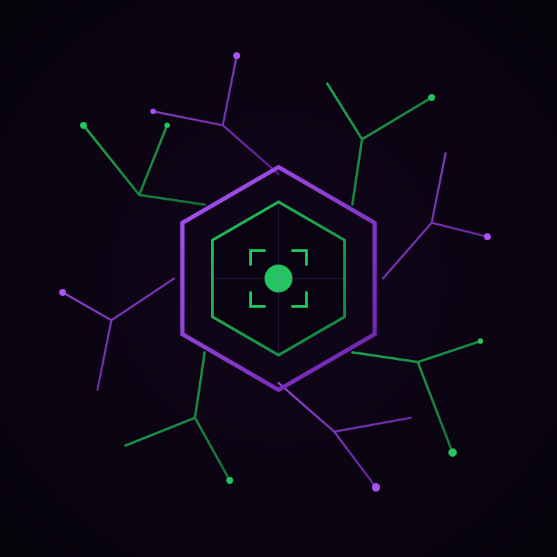
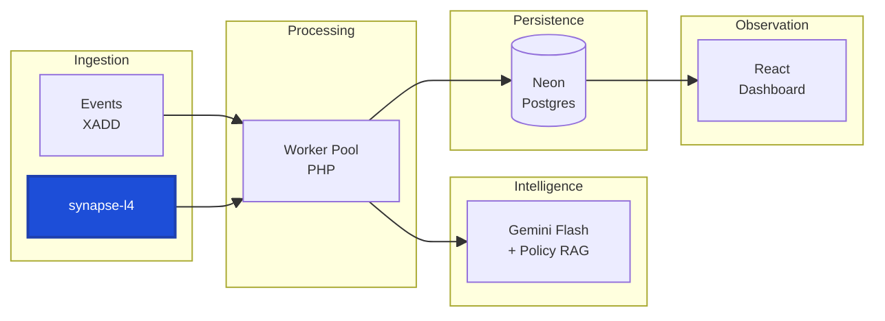
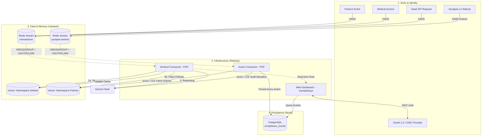
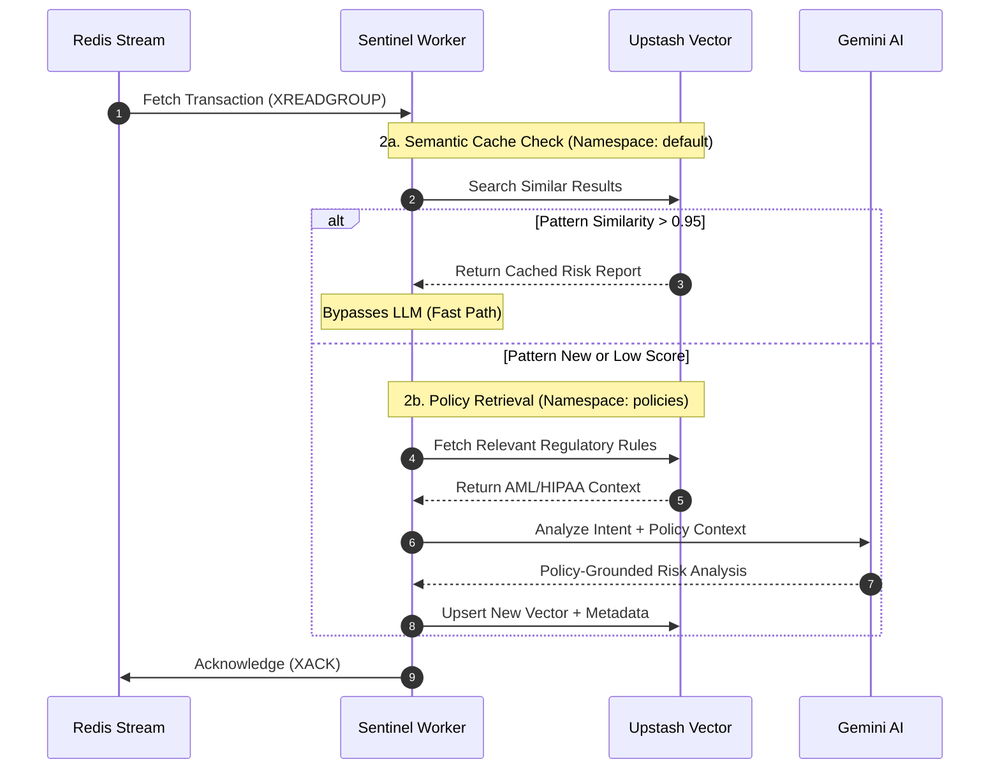
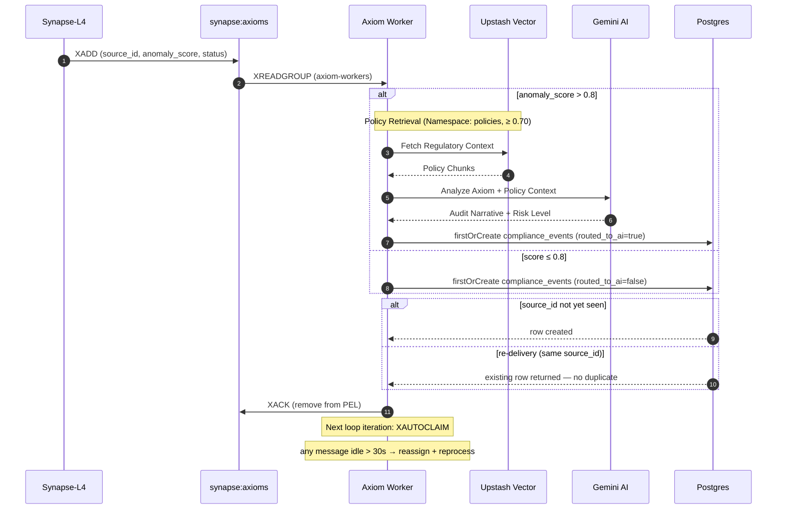
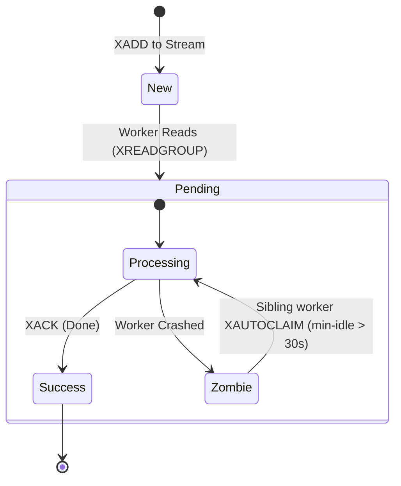
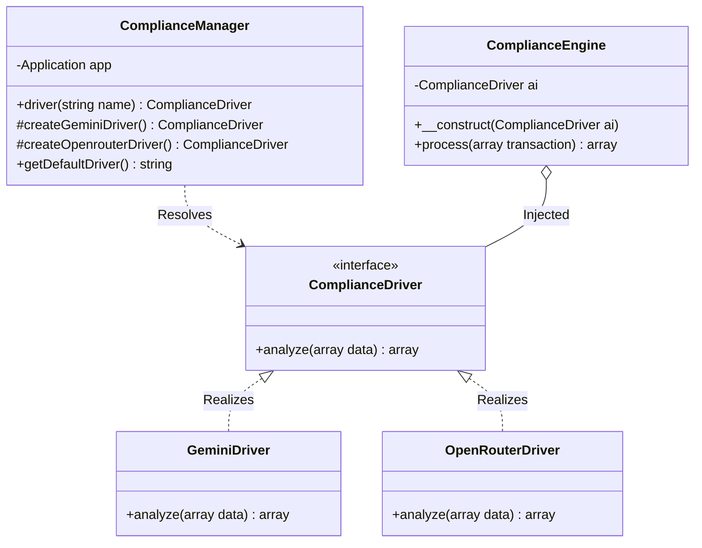
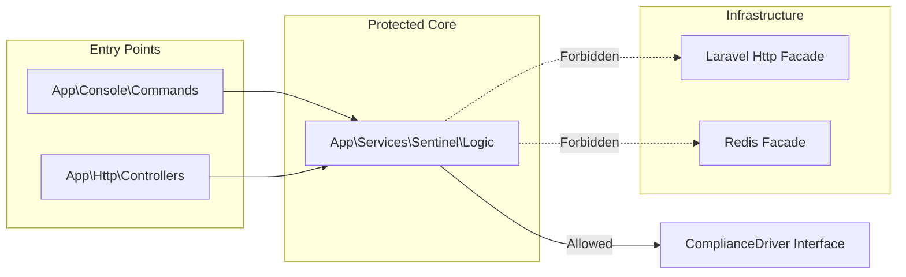

<p align="center">
  
</p>

 is a multi-process Laravel application built to explore production patterns for async message processing, semantic caching, and fault-tolerant distributed systems. It processes any scored event stream — financial events, medical access logs, SaaS API activity, raw system telemetry — and classifies each event against an indexed corpus of domain-specific policy documents to determine whether it exceeds a risk threshold. A compliance engine (AML, GDPR, HIPAA) is the domain used here; the architecture is domain-agnostic.

The [Synapse-L4](https://github.com/obrienma/synapse-l4) sidecar handles the [EventHorizon](https://github.com/obrienma/EventHorizon) telemetry path: it validates raw events through an LLM judge pass and emits typed, scored Axioms into the pipeline. Policy context is retrieved at analysis time by semantic similarity from a vector knowledge base (Upstash Vector, `policies` namespace) and filtered by domain tag, so an AML analysis is never grounded in GDPR chunks and vice versa.

🌐 **Early Signup:** https://sentinel-l7.cyberRhizome.ca/

---


```mermaid
%%{init: {'themeVariables': {'fontSize': '10px'}, 'flowchart': {'nodeSpacing': 15, 'rankSpacing': 25}}}%%
flowchart LR
    subgraph Ingestion
        A[Events<br/>XADD]
        SL[synapse-l4]
    end
    subgraph Processing
        B[Worker Pool<br/>PHP]
    end
    subgraph Intelligence
        C[Gemini Flash<br/>+ Policy RAG]
    end
    subgraph Persistence
        D[(Neon<br/>Postgres)]
    end
    subgraph Observation
        E[React<br/>Dashboard]
    end
    A --> B
    SL --> B
    B --> C
    B --> D
    D --> E

    click SL "https://github.com/obrienma/synapse-l4#readme" "Go to synapse-l4 repo"

    classDef clickable fill:#1d4ed8,stroke:#1e40af,stroke-width:2px,color:#ffffff
    class SL clickable
```

---

<p align="center">
  <a href="https://github.com/user-attachments/assets/30673fc0-eee5-43ae-ac4f-e76b49bc550f"></a>
  <a href="https://github.com/user-attachments/assets/cca0a4f7-7d69-4382-8a4e-e17a5d2ee0cf"></a>
  <a href="https://github.com/user-attachments/assets/666c862e-351c-4bec-be67-25cd69716864"></a>
</p>


## 📋 Contents

- [📋 Contents](#-contents)
- [🧰 Stack](#-stack)
- [🚀 Running the Project](#-running-the-project)
  - [✅ Prerequisites](#-prerequisites)
  - [⚡ Quick Start](#-quick-start)
  - [📦 Artisan Commands](#-artisan-commands)
- [🏗️ Architecture](#️-architecture)
  - [🔀 Pipeline Diagram](#-pipeline-diagram)
  - [🗂️ Processing Layers](#️-processing-layers)
  - [📐 Scale \& Fault Tolerance](#-scale--fault-tolerance)
  - [🧩 Laravel Patterns](#-laravel-patterns)
  - [Processing Loop](#processing-loop)
  - [Axiom Ingestion (Synapse-L4 → Compliance Events)](#axiom-ingestion-synapse-l4--compliance-events)
  - [Message Lifecycle (Fault Tolerance)](#message-lifecycle-fault-tolerance)
  - [Service Layer](#service-layer)
  - [Domain Logic Hierarchy](#domain-logic-hierarchy)
- [🔭 Observability](#-observability)
  - [🖥️ Application UI](#️-application-ui)
  - [🔍 Overview](#-overview)
  - [📊 Grafana Dashboard](#-grafana-dashboard)
- [📚 Docs](#-docs)
- [🗺️ Roadmap](#️-roadmap)
  - [📋 Planned](#-planned)
  - [📦 Production-Ready Baseline](#-production-ready-baseline)
    - [🔁 Core Ingestion \& Stream Reliability](#-core-ingestion--stream-reliability)
    - [🧠 AI Compliance Engine](#-ai-compliance-engine)
    - [🔷 Axiom / Synapse-L4 Integration](#-axiom--synapse-l4-integration)
    - [💾 Persistence \& Audit](#-persistence--audit)
    - [👁️ Frontend \& Operations](#️-frontend--operations)
    - [🔭 Observability](#-observability-1)


## 🧰 Stack

**🚀 Backend & Ingestion**

- **Laravel 12 / PHP 8.4:** Service container, queue, and Artisan command bus drive three long-running processes — web, transaction worker, and axiom worker — each consuming its own Redis Stream via `XREADGROUP`.
- **Upstash Redis Streams:** `XADD` / `XREADGROUP` / `XAUTOCLAIM` provide at-least-once delivery with a Pending Entry List; the web process never blocks waiting for analysis.

**⚡ AI & Vector**

- **Gemini Flash + OpenRouter:** LLM analysis runs through a swappable `ComplianceDriver` interface backed by a Laravel Service Manager; switching providers is a single env-var change, not a code change.
- **Upstash Vector:** Dual-namespace strategy — `default` (semantic cache, ≥ 0.95 threshold) cuts repeat LLM calls by 80%+; `policies` (RAG corpus, ≥ 0.70, domain-filtered) grounds compliance rulings in indexed regulatory documents (AML, HIPAA, GDPR).

**👁️ Frontend & Observability**

- **React 19 + Inertia.js + shadcn/ui:** Server-driven SPA — no API layer needed; dashboard, compliance events, and CSV export all use Inertia page components with a dark-default shadcn/Tailwind v4 theme.
- **OpenTelemetry:** Wide spans on both worker processes export via OTLP to a companion Grafana stack (Tempo + Prometheus); `traceparent` propagated from Synapse-L4 stream entries continues the upstream trace as a child span (ADR-0024).

**🧪 Testing & Infrastructure**

- **Pest:** Feature, unit, and architecture tests; arch tests in `tests/ArchTest.php` enforce domain layer isolation — `Http` and `Redis` facade imports are banned inside `App\Services\Sentinel\Logic`.
- **Neon PostgreSQL + Railway:** Serverless Postgres (non-pooled host — `SELECT … FOR UPDATE SKIP LOCKED` requirement) for `compliance_events` and `transactions`; Railway hosts all three processes.


## 🚀 Running the Project

### ✅ Prerequisites

- **PHP 8.4+** with Composer
- **Node.js 20+**
- **Upstash** account — Redis Streams + Vector namespaces (`default`, `policies`)
- **Neon** PostgreSQL database
- **Gemini API key** (or OpenRouter key if using that driver)

> [!NOTE]
> Developed on **WSL2 (Ubuntu)** and deployed to **Railway**. Other environments may work but are untested.

### ⚡ Quick Start

```bash
# 1. Install dependencies
composer install && npm install

# 2. Copy env and fill in Upstash, Neon, and Gemini credentials
cp .env.example .env

# 3. Run migrations
php artisan migrate

# 4. Index policy documents into the vector knowledge base
php artisan sentinel:ingest

# 5. Start all processes (web + queue + logs + Vite + axiom watcher)
composer dev

# 6. In a separate terminal, generate transactions
php artisan sentinel:stream --limit=100

# 7. Open the dashboard
open http://localhost:8000/dashboard
```

### 📦 Artisan Commands

| Command | Description |
| --- | --- |
| `composer dev` | Start all five processes: web, queue, logs, Vite, axiom watcher |
| `php artisan sentinel:stream --limit=100` | Simulate a transaction stream |
| `php artisan sentinel:watch` | Transaction worker (run alongside `sentinel:stream` for manual testing) |
| `php artisan sentinel:watch-axioms` | Axiom stream worker |
| `php artisan sentinel:ingest` | Index policy docs into vector KB (bumps policy epoch) |
| `php artisan sentinel:reset-metrics` | Reset dashboard counters |
| `./vendor/bin/pest --filter=TestName` | Run a single test |
| `./vendor/bin/pint` | Run the Pint linter |


## 🏗️ Architecture

### 🔀 Pipeline Diagram


```mermaid
graph TB
    subgraph "1. Entry & Identity"
        T1[Finance Event]
        T2[Medical Access]
        T3[SaaS API Request]
        SL4[Synapse-L4 Sidecar]
        IdP[OAuth 2.0 / OIDC Provider]
    end

    subgraph "2. Infrastructure (Railway)"
        Web[Web Dashboard - Inertia/React]
        Worker[Sentinel Consumer - PHP]
        AxiomWorker[Axiom Consumer - PHP]
    end

    subgraph "3. Data & Memory (Upstash)"
        Stream[(Redis Stream\ntransactions)]
        AxiomStream[(Redis Stream\nsynapse:axioms)]
        VectorCache[(Vector: Namespace Default)]
        VectorRules[(Vector: Namespace Policies)]
    end

    subgraph "4. Persistence (Neon)"
        PG[(PostgreSQL\ncompliance_events)]
    end

    Web <-->|OIDC Auth| IdP
    T1 & T2 & T3 -->|XADD| Stream
    SL4 -->|XADD Axioms| AxiomStream
    Stream -.->|XREADGROUP + XAUTOCLAIM| Worker
    AxiomStream -.->|XREADGROUP + XAUTOCLAIM| AxiomWorker
    Worker -->|2a. Search Cache| VectorCache
    Worker -->|2b. Fetch Policies| VectorRules
    Worker -->|3. Reasoning| AI[Gemini Flash]
    Worker -.->|Real-time Feed| Web
    Worker -->|Update Cache| VectorCache
    AxiomWorker -->|score > 0.8: Fetch Policies| VectorRules
    AxiomWorker -->|score > 0.8: Audit Narrative| AI
    AxiomWorker -->|Persist Every Axiom| PG
    Web -->|Query Events| PG
```

### 🗂️ Processing Layers

The system is composed of three long-running processes plus a shared intelligence and persistence layer.

| Layer | Key Files | Purpose & Responsibilities |
| :--- | :--- | :--- |
| **🌐 Web** | `app/Http/Controllers/` · `resources/js/Pages/` | **Dashboard & API:** Inertia/React dashboard, compliance event pages, CSV export endpoint, HTTP rate-limited routes. |
| **⚡ Transaction Worker** | `app/Console/Commands/WatchTransactions.php` · `app/Services/TransactionProcessorService.php` | **Stream Consumer:** `XREADGROUP` on `sentinel:transactions`; semantic cache check → optional AI analysis → `XACK`. `XAUTOCLAIM` recovery pass at top of every loop iteration. |
| **🔷 Axiom Worker** | `app/Console/Commands/WatchAxioms.php` · `app/Services/AxiomProcessorService.php` | **Axiom Consumer:** `XREADGROUP` on `synapse:axioms`; threshold routing (`anomaly_score > 0.8`) → AI audit narrative → Postgres. Every Axiom persisted — no silent drops. |
| **🧠 AI Layer** | `app/Contracts/ComplianceDriver.php` · `app/Services/ComplianceManager.php` | **Driver Abstraction:** Resolves `gemini` or `openrouter` from env via Laravel Service Manager; domain logic only depends on the `ComplianceDriver` interface. |
| **💾 Vector Layer** | `app/Services/VectorCacheService.php` · `app/Services/EmbeddingService.php` | **Semantic Cache + RAG:** Upstash Vector `default` namespace (cache, ≥ 0.95) + `policies` namespace (RAG, ≥ 0.70, domain-filtered); fingerprint embedding via Gemini `embedding-001` (1536-dim). |
| **🔌 MCP** | `app/Mcp/Servers/SentinelServer.php` · `routes/ai.php` | **Agent Protocol:** Model Context Protocol endpoint at `POST /mcp`; exposes `analyze_transaction`, `search_policies`, and `get_recent_transactions` tools to AI agents (Claude Desktop, Cursor, etc.). |

### 📐 Scale & Fault Tolerance

> [!NOTE]
> Because both workers implement `XAUTOCLAIM`-based self-healing and the persistence layer uses idempotent writes (`firstOrCreate` + partial unique index on `source_id`), the worker pool can safely scale horizontally with zero risk of data duplication. Losing a worker doesn't stop recovery — any running sibling claims orphaned messages on its next loop iteration (ADR-0022). A delivery-count guard hard-ACKs poison messages at `delivery_count >= 3` so a reliably crashing message cannot circulate indefinitely.

### 🧩 Laravel Patterns

* **Service Manager driver abstraction** — `ComplianceManager` extends Laravel's `Manager`; swap AI providers via `SENTINEL_AI_DRIVER` env var, no code change required
* **Arch-test-enforced domain isolation** — Pest architecture tests assert `App\Services\Sentinel\Logic` cannot import `Http` or `Redis` facades; enforced in `tests/ArchTest.php`
* **Policy epoch invalidation** — cached compliance verdicts carry an MD5 of the policy corpus; mismatched epochs on cache hits trigger re-analysis so no verdict survives a policy update unexamined
* **Prompt versioning** — all LLM templates live in `prompts/` as versioned Markdown with changelogs and `Used by:` lists; `GeminiDriver` loads the compiled `.txt` form at runtime; prompt drift is visible in git like code drift
* **Named rate limiters** — `RateLimiter::for()` limiters on login, signup, and `/dashboard/stream`; all thresholds backed by `RATE_LIMIT_*` env vars via `config/sentinel.php`

### Processing Loop


```mermaid
sequenceDiagram
    autonumber
    participant S as Redis Stream
    participant W as Sentinel Worker
    participant V as Upstash Vector
    participant G as Gemini AI

    S->>W: Fetch Transaction (XREADGROUP)

    note over W,V: 2a. Semantic Cache Check (Namespace: default)
    W->>V: Search Similar Results

    alt Pattern Similarity > 0.95
        V-->>W: Return Cached Risk Report
        Note over W: Bypasses LLM (Fast Path)
    else Pattern New or Low Score
        note over W,V: 2b. Policy Retrieval (Namespace: policies)
        W->>V: Fetch Relevant Regulatory Rules
        V-->>W: Return AML/HIPAA Context
        W->>G: Analyze Intent + Policy Context
        G-->>W: Policy-Grounded Risk Analysis
        W->>V: Upsert New Vector + Metadata
    end

    W->>S: Acknowledge (XACK)
```

### Axiom Ingestion (Synapse-L4 → Compliance Events)


```mermaid
sequenceDiagram
    autonumber
    participant SL4 as Synapse-L4
    participant AS as synapse:axioms
    participant AW as Axiom Worker
    participant V as Upstash Vector
    participant G as Gemini AI
    participant DB as Postgres

    SL4->>AS: XADD (source_id, anomaly_score, status)
    AS->>AW: XREADGROUP (axiom-workers)

    alt anomaly_score > 0.8
        note over AW,V: Policy Retrieval (Namespace: policies, ≥ 0.70)
        AW->>V: Fetch Regulatory Context
        V-->>AW: Policy Chunks
        AW->>G: Analyze Axiom + Policy Context
        G-->>AW: Audit Narrative + Risk Level
        AW->>DB: firstOrCreate compliance_events (routed_to_ai=true)
    else score ≤ 0.8
        AW->>DB: firstOrCreate compliance_events (routed_to_ai=false)
    end

    alt source_id not yet seen
        DB-->>AW: row created
    else re-delivery (same source_id)
        DB-->>AW: existing row returned — no duplicate
    end

    AW->>AS: XACK (remove from PEL)

    note over AW: Next loop iteration: XAUTOCLAIM
    note over AW: any message idle > 30s → reassign + reprocess
```

### Message Lifecycle (Fault Tolerance)


```mermaid
stateDiagram-v2
    [*] --> New: XADD to Stream
    New --> Pending: Worker Reads (XREADGROUP)

    state Pending {
        [*] --> Processing
        Processing --> Success: XACK (Done)
        Processing --> Zombie: Worker Crashed
    }

    Zombie --> Processing: Sibling worker XAUTOCLAIM (min-idle > 30s)
    Success --> [*]
```

### Service Layer


```mermaid
classDiagram
    direction TB

    class ComplianceDriver {
        <<interface>>
        +analyze(array data) array
    }

    class GeminiDriver {
        +analyze(array data) array
    }

    class OpenRouterDriver {
        +analyze(array data) array
    }

    class ComplianceManager {
        -Application app
        +driver(string name) ComplianceDriver
        #createGeminiDriver() ComplianceDriver
        #createOpenrouterDriver() ComplianceDriver
        +getDefaultDriver() string
    }

    class ComplianceEngine {
        -ComplianceDriver ai
        +__construct(ComplianceDriver ai)
        +process(array transaction) array
    }

    ComplianceDriver <|.. GeminiDriver : Realizes
    ComplianceDriver <|.. OpenRouterDriver : Realizes
    ComplianceManager ..> ComplianceDriver : Resolves
    ComplianceEngine o-- ComplianceDriver : Injected
```

### Domain Logic Hierarchy


```mermaid
graph LR
    subgraph "Protected Core"
        Domain[App\Services\Sentinel\Logic]
    end

    subgraph "Infrastructure"
        Http[Laravel Http Facade]
        Redis[Redis Facade]
    end

    subgraph "Entry Points"
        Web[App\Http\Controllers]
        Console[App\Console\Commands]
    end

    Console --> Domain
    Web --> Domain
    Domain -.->|Forbidden| Http
    Domain -.->|Forbidden| Redis
    Domain -->|Allowed| Contract[ComplianceDriver Interface]
```


## 🔭 Observability

### 🖥️ Application UI

The application UI (`/dashboard`) is a server-driven React/Inertia SPA with four main surfaces:

- **Live transaction feed** — real-time stream of processed transactions with risk level, cache-hit/miss indicator, and AI routing signal
- **Compliance Events** — paginated audit trail of every persisted `compliance_events` row; toggle between flagged-only and all events; CSV export with optional date-range filter
- **Backpressure widget** — consumer lag stat card reading `sentinel:consumer_lag` (10s TTL), colour-coded emerald/amber/red against the `lag_warn`/`lag_pause` thresholds; shows a dash when the worker is offline
- **Metrics counters** — processed count, cache hit rate, flagged event count; reset with `php artisan sentinel:reset-metrics`

> [!NOTE]
> Additional screenshots coming — the GIFs at the top of this README show the dashboard and terminal worker in action.

### 🔍 Overview

The Axiom Worker emits one `axiom.process` span per message — decorated with `source_id`, `anomaly_score`, `domain`, and `routed_to_ai` attributes — and continues the `traceparent` propagated from Synapse-L4, stitching the full cross-service trace. For deeper visibility, Sentinel exports to a companion **[Grafana monitoring stack](https://github.com/obrienma/rhizome-observability#readme)** (Tempo + Prometheus) that surfaces service health, processing latency p50/p95/p99, and AI routing signals that the HTTP response can't show.

The dashboard's **AI Analysis by Driver** and **AI Confidence** panels read `ai.driver` / `ai.confidence` attributes, which `AxiomProcessorService::routeToAi()` only sets when `ComplianceDriver::analyze()` succeeds. With a placeholder API key the call throws — the failure surfaces in the **AI Errors** panel and the two AI panels stay empty. To populate them:

1. Set a working credential for the active `SENTINEL_AI_DRIVER`:
   `openrouter` → `OPENROUTER_API_KEY` (+ `OPENROUTER_MODEL`); `gemini` → `GEMINI_API_KEY` (+ `GEMINI_FLASH_URL`).
2. Send Axioms with `anomaly_score > AXIOM_AUDIT_THRESHOLD` (default `0.8`) so they route to AI — sub-threshold Axioms never emit `axiom.ai_analysis` attributes.
3. Run `php artisan sentinel:watch-axioms` with the OTel exporter pointed at the collector.

No dashboard change is needed once a driver call succeeds — the queries are already correct.

### 📊 Grafana Dashboard

> [!TIP]
> The dashboard lives in [rhizome-observability](https://github.com/obrienma/rhizome-observability#readme). All 9 panels are TraceQL-metrics queries over `axiom.process` / `axiom.ai_analysis` span attributes — no Prometheus counters required. Requires **Tempo ≥ 2.7** with `filter_server_spans: false` (Sentinel spans are `INTERNAL`-kind).


## 📚 Docs

| File | Contents | Last updated |
| --- | --- | --- |
| [README.md](README.md) | Project overview | 2026-06-17 |
| [ARCHITECTURE.md](docs/ARCHITECTURE.md) | System design, data flows, worker loop structure | — |
| [SERVICES.md](docs/SERVICES.md) | Per-service reference | — |
| [API.md](docs/API.md) | HTTP + MCP routes | — |
| [AI_PIPELINE.md](docs/AI_PIPELINE.md) | Gemini driver, RAG pipeline, prompt versioning | — |
| [TESTING.md](docs/TESTING.md) | Test strategy, known gaps | — |
| [USER_STORIES.md](docs/USER_STORIES.md) | Compliance officer, platform engineer, AI agent | — |
| [DEV_GETTING_STARTED.md](docs/DEV_GETTING_STARTED.md) | Full local setup walkthrough | — |
| [journal.md](docs/journal.md) | Engineering journal — one entry per phase | — |
| [adr/](docs/adr/) | Architecture Decision Records (ADR-0001 – ADR-0025) | — |


## 🗺️ Roadmap

### 📋 Planned

* [ ] **OTel Phase 3** — EventHorizon instrumentation (four-stage RabbitMQ trace, malformed-message span events)
* [ ] **EventHorizon deep-link** — `source_id` correlation from compliance event back to the originating EventHorizon event
* [ ] **Silent partial failure alerting** — wire `under_indexed` warnings and `quality_score` logs to an active alert (e.g. N consecutive under-indexed queries on domain X, or `quality_score=0` for N consecutive events)
* [ ] **OAuth on the MCP endpoint** — `Mcp::oauthRoutes()` before production agent access
* [ ] **CI pipeline** — architecture tests + unit suite running on every push
* [ ] **End-to-end idempotency audit** — verify EventHorizon event ID flows through Synapse-L4 as `source_id` on the Axiom (early-exit dedup in `AxiomProcessorService` is done; source_id provenance through the full chain is not yet verified)
* [ ] **Fingerprint field reconciliation (ADR-0002/ADR-0015)** — the transaction fingerprint now includes a randomly-templated `message` field, adding entropy that may suppress cache hits; revisit alongside the open amount-representation (ADR-0002) and similarity-threshold (ADR-0015) questions
* [ ] **Ollama embedding driver implementation (ADR-0025)** — `EmbeddingDriver` interface + `EmbeddingManager`, `OllamaEmbeddingDriver` (nomic-embed-text v1.5, 768-dim, task-prefixed inputs), Upstash Vector index recreated at 768 dimensions, policy KB re-ingested; decision recorded, implementation not yet started

### 📦 Production-Ready Baseline

> [!TIP]
> **22+ features shipped** | **Pest architecture + unit suite green**

<details>
<summary>🔍 View shipped features...</summary>

#### 🔁 Core Ingestion & Stream Reliability
* Core pipeline — Redis Streams, semantic cache, fault tolerance (XCLAIM)
* Backpressure step 1 — `XREAD COUNT 1` on transaction stream + `XLEN` producer guard (`sentinel.backpressure.publish_pause_threshold`, default 800) pauses `sentinel:stream` when depth exceeds threshold
* Backpressure step 2 — XREADGROUP + XAUTOCLAIM self-healing worker pool (ADR-0022): transaction stream migrated to consumer group `sentinel-consumers`; `XAUTOCLAIM` embedded at top of each worker loop; dead-letter guard ACKs poison messages at `delivery_count >= 3`; dedicated reclaimer daemon removed
* Backpressure step 3 — graduated consumer lag signal (ADR-0023): worker writes `XPENDING` count to `sentinel:consumer_lag` (TTL 10s); producer applies soft-limit sleep (500ms, configurable) at lag > 50, spin-wait at lag > 200
* Weighted transaction simulation — `simulation.merchants` config holds weighted profiles (category, weight, amount range, currencies, `is_threat`) instead of a flat uniform-probability list; `TransactionStreamService::generate()` samples via an index-repetition pool so traffic mix reflects realistic merchant volume
* Benchmark seeder — `database/seeders/TransactionSeeder.php` runs N simulated transactions through the live pipeline and reports cache hit rate, fallbacks, embedding API call count, and threat rate

#### 🧠 AI Compliance Engine
* ComplianceDriver stack — `GeminiDriver` (Gemini Flash + policy RAG), `OpenRouterDriver` (OpenAI-compatible, swap via env), `ComplianceManager` (Laravel Service Manager pattern)
* Policy RAG — `sentinel:ingest` chunking pipeline, `policies/` corpus, score-aware query formulation
* Domain-scoped RAG retrieval — `domain` metadata tag at ingest; server-side filter at query time; retrieval quality logging
* Output quality scoring — 4-signal rubric on every compliance driver response; `low quality score` warning when score ≤ 1
* Retrieval coverage logging — `mean_score` and `under_indexed` per RAG query; `Log::warning` fires when a domain filter returns < 2 chunks

#### 🔷 Axiom / Synapse-L4 Integration
* Synapse-L4 Axiom ingestion — `synapse:axioms` Redis stream + `sentinel:watch-axioms` worker
* Synapse-L4 Python sidecar — FastAPI LLM judge pass + Redis emitter
* Idempotent Axiom persistence — `firstOrCreate` + partial unique index on `source_id` + `UniqueConstraintViolationException` catch; re-delivered stream messages never produce duplicate `compliance_events` rows
* Early-exit idempotency in `AxiomProcessorService` — `EXISTS` check on `source_id` before AI routing; duplicate re-deliveries short-circuit before Gemini is called; DB-layer `firstOrCreate` remains as concurrent-race fallback
* XCLAIM recovery for `synapse:axioms` consumer group — `XAUTOCLAIM` embedded in worker loop (ADR-0022)

#### 💾 Persistence & Audit
* `compliance_events` audit trail — Postgres persistence with `source_id` correlation
* Transaction history — processed transactions persisted to Postgres `transactions` table
* Compliance dashboard — Flags / Events nav pages surfacing `compliance_events`
* Compliance report CSV export — `GET /compliance/export` streams flagged/all events chunked at 500 rows; optional `from`/`to` date filters; UI date-range picker on the Compliance page

#### 👁️ Frontend & Operations
* React 19 + shadcn/ui dashboard with live transaction feed
* Backpressure dashboard widget — consumer lag stat card reads `sentinel:consumer_lag` (10s TTL); colour-coded emerald/amber/red against `lag_warn`/`lag_pause` config thresholds; dash when worker is offline
* HTTP rate limiting — named `RateLimiter::for()` limiters on login (5/min per IP), signup (10/hr per IP), `/dashboard/stream` (20/min per authenticated user); all thresholds config-backed via `RATE_LIMIT_*` env vars

#### 🔭 Observability
* MCP server — exposes `analyze_transaction`, `search_policies`, `get_recent_transactions` tools to AI agents via Model Context Protocol at `POST /mcp`
* OTel instrumentation (Phase 2) — `OtelServiceProvider` bootstraps SDK (BatchSpanProcessor → OTLP HTTP); `AxiomProcessorService` wraps processing in wide spans with `source_id`, `anomaly_score`, `domain`, `routed_to_ai` attributes; `traceparent` extracted from stream entries to continue Synapse-L4 trace as child span (ADR-0024)
* Grafana dashboard — "Sentinel-L7 Service" — 9 panels, TraceQL-metrics queries over `axiom.process` / `axiom.ai_analysis` spans (no Prometheus counters required); throughput by risk level/domain/AI routing, latency p50/p95/p99, anomaly-score and AI-confidence aggregates

</details>
