# RAG Pipeline

> **Status: Architecture documented — implementation in progress.**
> The vector namespaces and embedding infrastructure exist. Policy ingestion command (`sentinel:ingest`) is implemented. RAG injection into the AI prompt is the next milestone.

## What is RAG Here?

Retrieval-Augmented Generation (RAG) means the AI doesn't reason from its training data alone — it retrieves the actual regulatory text relevant to a given transaction and reasons against that. This gives compliance justifications grounded in real policy documents rather than approximate model knowledge.

## Pipeline Overview

```mermaid
flowchart TD
    subgraph Ingestion["Policy Ingestion (sentinel:ingest)"]
        MD[".md policy files\n(AML, HIPAA, GDPR, etc.)"] --> Chunk[Chunk into\nsections]
        Chunk --> Embed1["EmbeddingService\nGemini → vector"]
        Embed1 --> Upsert["VectorCacheService.upsert\nns:policies"]
    end

    subgraph Runtime["Transaction Processing (sentinel:consume)"]
        TXN[Incoming transaction] --> Fingerprint[Build fingerprint]
        Fingerprint --> CacheSearch["VectorCacheService.search\nns:default / ≥ 0.95"]

        CacheSearch -->|Miss| PolicySearch["VectorCacheService.search\nns:policies / ≥ 0.70"]
        PolicySearch --> PolicyCtx["Retrieved policy context\ne.g. AML-001, BSA-THRESHOLD"]

        PolicyCtx --> Prompt["Build prompt\ntransaction + policy context"]
        Prompt --> Gemini["Gemini Flash\nstructured JSON analysis"]
        Gemini --> Result["ThreatResult\n+ matchedPolicies[]"]

        Result --> CacheUpsert["Upsert to ns:default\nfor future cache hits"]
    end

    Upsert -.->|policies namespace| PolicySearch

    style Ingestion fill:#0f172a,stroke:#10b981
    style Runtime fill:#0f172a,stroke:#3b82f6
```



## Policy Document Format

Policy files live in `storage/policies/` (or `resources/policies/`). Markdown format:

```markdown
# AML-001: Currency Transaction Reporting

## Threshold
Transactions of $10,000 or more must be reported (31 CFR § 1010.311).

## Structuring
Deliberately breaking transactions to stay below the $10,000 threshold
("smurfing") is a federal offense (31 U.S.C. § 5324).

## Indicators
- Multiple cash transactions by same customer on same day totaling ≥ $10,000
- Unusual reluctance to provide identification
- Transactions just below reporting thresholds ($9,900–$9,999)
```

Each section becomes a separately-embedded chunk for fine-grained retrieval.

## Prompt Template (v2)

The v2 prompt injects retrieved policy context:

```
Analyze the following financial transaction for compliance violations.

Transaction:
{{transaction}}

Relevant compliance policies:
{{policies}}

If no policies were retrieved, apply general AML/HIPAA/GDPR principles.

Respond in JSON: { "risk_level", "flags", "confidence", "justification", "matchedPolicies" }
```

## Similarity Thresholds

| Namespace | Threshold | Rationale |
|-----------|-----------|-----------|
| `default` (cache) | ≥ 0.95 | Near-exact match — same transaction pattern |
| `policies` (RAG) | ≥ 0.70 | Topical relevance — related regulatory domain |

The lower policy threshold ensures we retrieve applicable rules even when the transaction description doesn't closely match the regulatory text verbatim.

## Re-indexing

```bash
# Re-index all policy documents (idempotent — upsert by policy ID)
php artisan sentinel:ingest

# Future: index a single file
php artisan sentinel:ingest --file=AML-001.md
```

## What Gets Stored in Upstash Vector (ns:policies)

Each vector entry metadata:

```json
{
  "id": "policy-aml-001-chunk-3",
  "policy_name": "AML-001",
  "section": "Structuring",
  "text": "Deliberately breaking transactions...",
  "version": "2024-01"
}
```

`matchedPolicies` in the AI response references these `policy_name` values for audit traceability.
