# RAG Pipeline

> **Status: Live.** Policy ingestion (`sentinel:ingest`) and retrieval (`GeminiDriver`) are both implemented and wired end-to-end.

## What is RAG Here?

Retrieval-Augmented Generation means the AI doesn't reason from training data alone — it retrieves the actual regulatory text relevant to a given Axiom and reasons against that. This gives compliance justifications grounded in real policy documents rather than approximate model knowledge.

## Pipeline Overview

```mermaid
flowchart TD
    subgraph Ingestion["Policy Ingestion (sentinel:ingest)"]
        MD[".md policy files\npolicies/*.md"] --> Chunk["Chunk on paragraph\nboundaries ~500 words"]
        Chunk --> Embed1["EmbeddingService::embed\nGemini embedding-001 → 1536-dim"]
        Embed1 --> Upsert["VectorCacheService::upsertNamespace\nns:policies"]
    end

    subgraph Runtime["Axiom Processing (sentinel:watch-axioms)"]
        AX[Incoming Axiom\nanomaly_score > 0.8] --> Query["GeminiDriver::buildQueryText\ntranslate score → severity phrase"]
        Query --> Embed2["EmbeddingService::embed\ncomply question → vector"]
        Embed2 --> PolicySearch["VectorCacheService::searchNamespace\nns:policies / ≥ 0.70 / top 3"]

        PolicySearch -->|chunks found| PolicyCtx["Retrieved policy context\ne.g. AML-BSA-001 escalation thresholds"]
        PolicySearch -->|empty| NoCtx["No context —\nproceed without RAG"]

        PolicyCtx & NoCtx --> Prompt["buildPrompt\nAxiom + policy chunks"]
        Prompt --> Gemini["Gemini Flash\nstructured JSON"]
        Gemini --> Result["{narrative, risk_level,\npolicy_refs, confidence}"]
        Result --> Persist["ComplianceEvent\nPostgres"]
    end

    Upsert -.->|ns:policies| PolicySearch

    style Ingestion fill:#0f172a,stroke:#10b981
    style Runtime fill:#0f172a,stroke:#3b82f6
```



## Similarity Thresholds

| Namespace | Threshold | Purpose |
|-----------|-----------|---------|
| `default` (cache) | ≥ 0.95 | Near-duplicate detection — same transaction pattern |
| `policies` (RAG) | ≥ 0.70 | Topical relevance — related regulatory domain |

The lower policy threshold is intentional: a compliance question and the policy text that answers it embed at naturally lower similarity than two near-identical transactions.

## Query Formulation

`GeminiDriver::buildQueryText()` translates raw Axiom fields into a compliance-vocabulary question:

| anomaly_score | Generated query phrase |
|---|---|
| ≥ 0.90 | `"...critical severity requiring immediate escalation and reporting"` |
| ≥ 0.80 | `"...high severity requiring compliance review and possible regulatory notification"` |
| ≥ 0.60 | `"...moderate severity requiring monitoring and documentation"` |
| < 0.60 | `"...low severity for audit logging"` |

This ensures the query embedding lands in the same semantic space as policy text about reporting obligations and thresholds — not in the telemetry/sensor space.

## Policy Document Format

Policy files live in `policies/` at the repo root. Markdown format, committed to git alongside the code.

```markdown
# AML-BSA-001: Anti-Money Laundering and Bank Secrecy Act

## Currency Transaction Reports (CTR)
Transactions exceeding $10,000 must be reported...

## Suspicious Activity Reports (SAR)
A SAR must be filed when...
```

Each paragraph block becomes a separately-embedded chunk for fine-grained retrieval.

## What Gets Stored in Upstash Vector (ns:policies)

```json
{
  "id": "aml-bsa-compliance_2",
  "vector": [0.023, -0.441, ...],
  "metadata": {
    "text": "A Suspicious Activity Report (SAR) must be filed...",
    "source": "aml-bsa-compliance",
    "chunk": 2
  }
}
```

## Running the Ingestion

```bash
# Index all policy documents (idempotent — upsert by chunk ID)
php artisan sentinel:ingest

# Use a different directory
php artisan sentinel:ingest --path=storage/policies

# Adjust chunk size
php artisan sentinel:ingest --chunk-size=300
```
