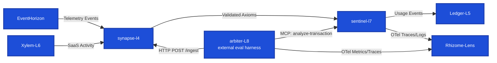

```mermaid
%%{init: {'themeVariables': {'fontSize': '10px'}, 'flowchart': {'nodeSpacing': 15, 'rankSpacing': 25}}}%%
flowchart LR
    EH[EventHorizon]
    XY[Xylem-L6]
    SL[synapse-l4]
    AR[arbiter-L8<br/>external eval harness]
    SentinelL7[sentinel-l7]
    LE[Ledger-L5]
    RL[Rhizome-Lens]

    SL ~~~ AR

    EH -->|Telemetry Events| SL
    XY -->|SaaS Activity| SL
    SL -->|Validated Axioms| SentinelL7
    SentinelL7 -->|Usage Events| LE
    SentinelL7 -->|OTel Traces/Logs| RL
    AR -->|HTTP POST /ingest| SL
    AR -->|MCP: analyze-transaction| SentinelL7
    AR -->|OTel Metrics/Traces| RL

    click EH "https://github.com/obrienma/EventHorizon#readme" "Go to EventHorizon repo"
    click XY "https://github.com/obrienma/Xylem-L6#readme" "Go to Xylem-L6 repo"
    click SL "https://github.com/obrienma/synapse-l4#readme" "Go to synapse-l4 repo"
    click AR "https://github.com/obrienma/Arbiter-L8#readme" "Go to arbiter-L8 repo"
    click SentinelL7 "https://github.com/obrienma/sentinel-l7#readme" "Go to sentinel-l7 repo"
    click LE "https://github.com/obrienma/Ledger-L5#readme" "Go to Ledger-L5 repo"
    click RL "https://github.com/obrienma/Rhizome-Lens#readme" "Go to Rhizome-Lens repo"

    classDef clickable fill:#1d4ed8,stroke:#1e40af,stroke-width:2px,color:#ffffff
    class EH,XY,SL,AR,SentinelL7,LE,RL clickable
```
