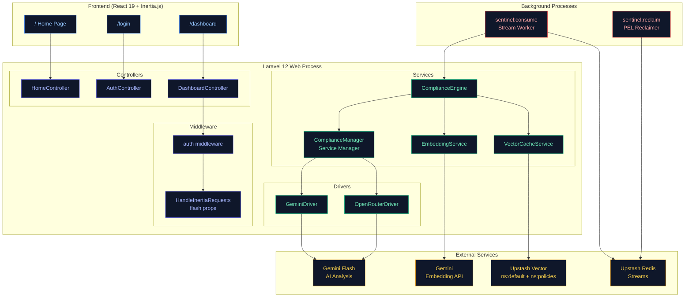
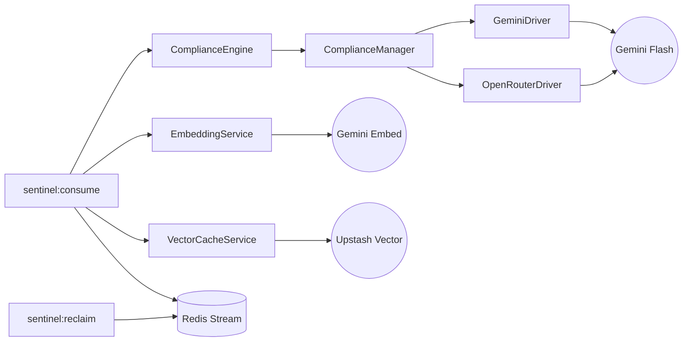
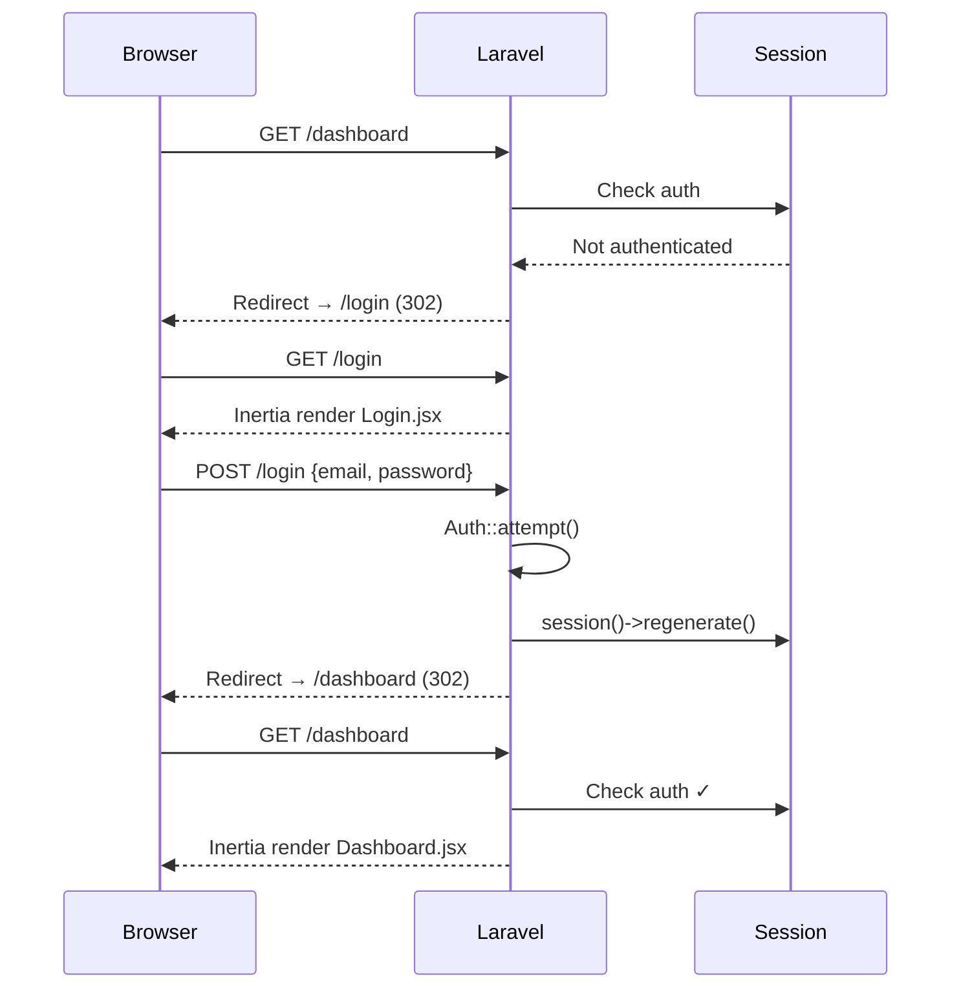

# System Architecture Diagrams

## High-Level Component Map

```mermaid
graph TB
    subgraph Frontend["Frontend (React 19 + Inertia.js)"]
        Home["/ Home Page"]
        Login["/login"]
        Dash["/dashboard"]
    end

    subgraph Backend["Laravel 12 Web Process"]
        subgraph Controllers
            HC[HomeController]
            AC[AuthController]
            DC[DashboardController]
        end

        subgraph Middleware
            HIR[HandleInertiaRequests\nflash props]
            AM[auth middleware]
        end

        subgraph Services
            CE[ComplianceEngine]
            CM[ComplianceManager\nService Manager]
            ES[EmbeddingService]
            VCS[VectorCacheService]
        end

        subgraph Drivers
            GD[GeminiDriver]
            OD[OpenRouterDriver]
        end
    end

    subgraph Workers["Background Processes"]
        W[sentinel:consume\nStream Worker]
        R[sentinel:reclaim\nPEL Reclaimer]
    end

    subgraph External["External Services"]
        GemEmbed["Gemini\nEmbedding API"]
        GemAI["Gemini Flash\nAI Analysis"]
        UV["Upstash Vector\nns:default + ns:policies"]
        Redis["Upstash Redis\nStreams"]
    end

    Home --> HC
    Login --> AC
    Dash --> DC
    DC --> AM
    AM --> HIR

    W --> CE
    CE --> CM
    CM --> GD & OD
    GD --> GemAI
    OD --> GemAI
    CE --> ES --> GemEmbed
    CE --> VCS --> UV
    W --> Redis
    R --> Redis

    classDef frontend fill:#0f172a,stroke:#3b82f6,color:#93c5fd
    classDef controller fill:#0f172a,stroke:#6366f1,color:#a5b4fc
    classDef service fill:#0f172a,stroke:#10b981,color:#6ee7b7
    classDef external fill:#0f172a,stroke:#f59e0b,color:#fcd34d
    classDef worker fill:#0f172a,stroke:#ef4444,color:#fca5a5

    class Home,Login,Dash frontend
    class HC,AC,DC,HIR,AM controller
    class CE,CM,ES,VCS,GD,OD service
    class GemEmbed,GemAI,UV,Redis external
    class W,R worker
```

## Service Dependency Graph

```mermaid
graph LR
    W[sentinel:consume] --> CE[ComplianceEngine]
    W --> ES[EmbeddingService]
    W --> VCS[VectorCacheService]
    W --> Redis[(Redis Stream)]

    CE --> CM[ComplianceManager]
    CM --> GD[GeminiDriver]
    CM --> OD[OpenRouterDriver]

    GD & OD --> GemAI((Gemini Flash))
    ES --> GemEmbed((Gemini Embed))
    VCS --> UV((Upstash Vector))

    R[sentinel:reclaim] --> Redis
```

## Auth Flow

```mermaid
sequenceDiagram
    participant B as Browser
    participant L as Laravel
    participant S as Session

    B->>L: GET /dashboard
    L->>S: Check auth
    S-->>L: Not authenticated
    L-->>B: Redirect → /login (302)

    B->>L: GET /login
    L-->>B: Inertia render Login.jsx

    B->>L: POST /login {email, password}
    L->>L: Auth::attempt()
    L->>S: session()->regenerate()
    L-->>B: Redirect → /dashboard (302)

    B->>L: GET /dashboard
    L->>S: Check auth ✓
    L-->>B: Inertia render Dashboard.jsx
```
