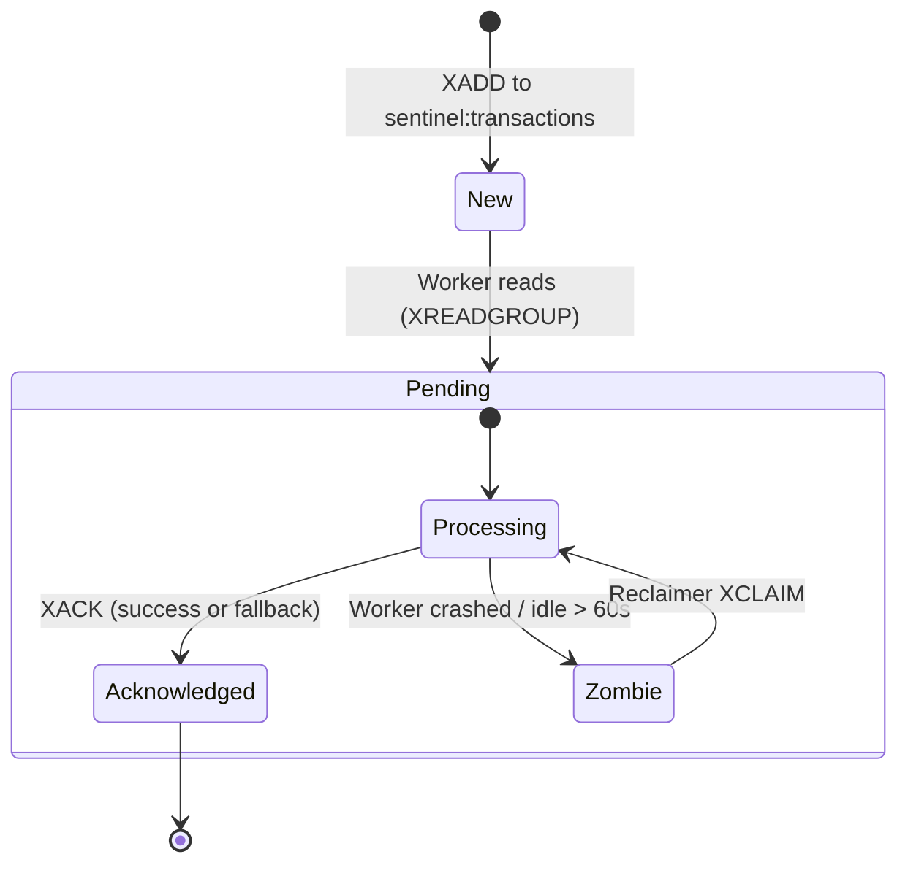
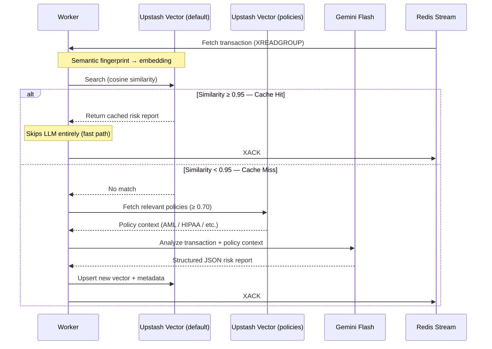

# Transaction Processing Pipeline

## Full Worker Flow

```mermaid
flowchart TD
    Start([sentinel:consume]) --> EnsureGroup[XGROUP CREATE\nsentinel:transactions]
    EnsureGroup --> RecoverPEL[XPENDING — find\nzombie messages]

    RecoverPEL --> RecoveredCheck{Recovered\nmessages?}
    RecoveredCheck -- Yes --> ProcessRecovered[Reprocess each\nrecovered record]
    ProcessRecovered --> MainLoop
    RecoveredCheck -- No --> MainLoop

    MainLoop[Main Consumer Loop] --> ReadGroup["XREADGROUP\nBLOCK 5000ms"]
    ReadGroup --> ForEach{For each\nrecord}
    ForEach --> ProcessRecord

    subgraph ProcessRecord["processRecord(record)"]
        Parse[Parse transaction payload] --> Idempotency{Already\nseen?}
        Idempotency -- Yes --> Skip[Skip — XACK]
        Idempotency -- No --> Fingerprint["Build fingerprint\nAmount|Type|Category|Time|Merchant"]
        Fingerprint --> Embed["EmbeddingService\nGemini → vector"]
        Embed --> Search["VectorCacheService.search\nUpstash ns:default / cosine ≥ 0.95"]

        Search --> CacheCheck{Cache\nhit?}

        CacheCheck -- "Hit ✓" --> LogHit[Log cached result\n+ record cache_hit metric]
        LogHit --> ACK1[XACK]

        CacheCheck -- "Miss ✗" --> PolicyRAG["Fetch policies\nUpstash ns:policies / ≥ 0.70"]
        PolicyRAG --> AIAnalysis["ComplianceEngine.analyze\nGemini Flash + policy context"]
        AIAnalysis --> Upsert["VectorCacheService.upsert\nStore for future hits"]
        Upsert --> LogMiss[Log AI result\n+ record cache_miss metric]
        LogMiss --> ACK2[XACK]
    end

    ProcessRecord --> MainLoop

    subgraph Fallback["On infrastructure failure"]
        RuleBased["Rule-based analysis\n(no AI, no vector)"]
        RuleBased --> LogFallback[Log + record fallback metric]
        LogFallback --> ACK3[XACK — always ack,\neven on fallback]
    end

    Embed -.->|Gemini/Vector failure| Fallback

    style ProcessRecord fill:#0f172a,stroke:#3b82f6
    style Fallback fill:#0f172a,stroke:#ef4444
```

## Message Lifecycle State Machine

```mermaid
stateDiagram-v2
    [*] --> New: XADD to sentinel:transactions
    New --> Pending: Worker reads (XREADGROUP)

    state Pending {
        [*] --> Processing
        Processing --> Acknowledged: XACK (success or fallback)
        Processing --> Zombie: Worker crashed / idle > 60s
    }

    Zombie --> Processing: Reclaimer XCLAIM
    Acknowledged --> [*]
```

## Semantic Cache Logic

```mermaid
sequenceDiagram
    participant W as Worker
    participant V as Upstash Vector (default)
    participant P as Upstash Vector (policies)
    participant G as Gemini Flash
    participant S as Redis Stream

    S->>W: Fetch transaction (XREADGROUP)

    Note over W,V: Semantic fingerprint → embedding
    W->>V: Search (cosine similarity)

    alt Similarity ≥ 0.95 — Cache Hit
        V-->>W: Return cached risk report
        Note over W: Skips LLM entirely (fast path)
        W->>S: XACK
    else Similarity < 0.95 — Cache Miss
        V-->>W: No match
        W->>P: Fetch relevant policies (≥ 0.70)
        P-->>W: Policy context (AML / HIPAA / etc.)

        W->>G: Analyze transaction + policy context
        G-->>W: Structured JSON risk report

        W->>V: Upsert new vector + metadata
        W->>S: XACK
    end
```
