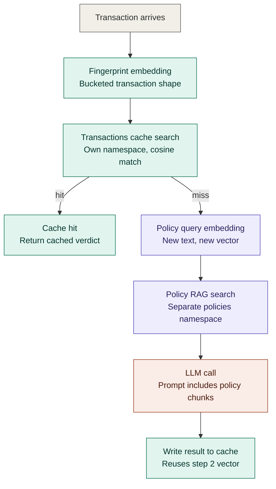
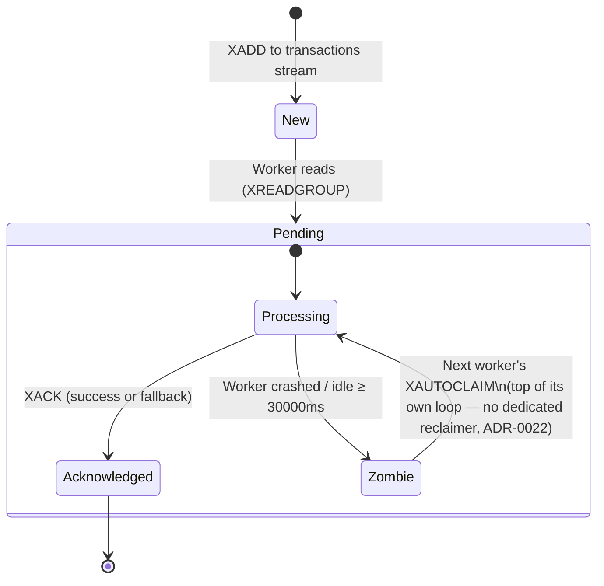
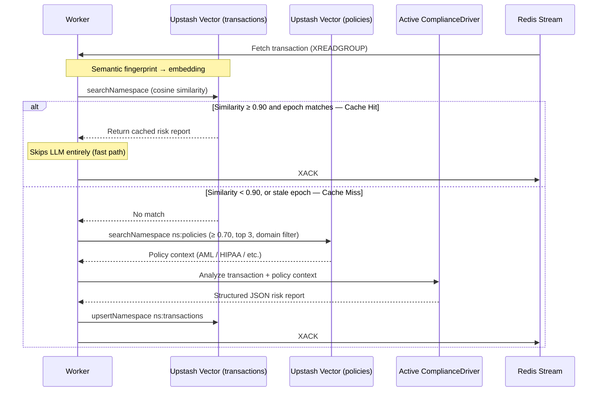

# Transaction Processing Pipeline

## Cache vs. RAG — Two Separate Vector Systems

The fingerprint/cache system and the policy RAG system are two independent vector spaces — different namespaces, different embeddings, different similarity thresholds. They never touch each other. The only place the fingerprint vector reappears is the final write-back step, and it's the same vector computed at step 2, not anything produced by RAG.

| System | Namespace | Threshold | Embedding driver |
|---|---|---|---|
| Transaction cache | `transactions` | ≥ 0.90 (`UPSTASH_VECTOR_THRESHOLD`, ADR-0015) | Active `EmbeddingDriver` — Ollama `nomic-embed-text` default (ADR-0025) or Gemini `embedding-001` |
| Policy RAG | `policies` | ≥ 0.70 | Same `EmbeddingDriver`, different query text |

No implicit/default namespace is used anywhere — both are explicit (ADR-0026).

## Full Worker Flow

```mermaid
%%{init: {'themeVariables': {'fontSize': '10px'}, 'flowchart': {'nodeSpacing': 15, 'rankSpacing': 25}}}%%
flowchart TD
    Start(["sentinel:watch"]) --> Loop["Top of every loop iteration"]
    Loop --> Reclaim["XAUTOCLAIM\nidle ≥ sentinel.reclaim.idle_ms (30000ms)"]

    Reclaim --> ClaimedCheck{"Claimed\nmessages?"}
    ClaimedCheck -- "Yes" --> DeliveryCheck{"deliveryCount ≥\nsentinel.reclaim.delivery_count_limit (3)?"}
    DeliveryCheck -- "Yes" --> DeadLetter["Log::error + XACK\nwithout processing"]
    DeliveryCheck -- "No" --> ProcessRecord
    ClaimedCheck -- "No" --> ReadGroup

    ReadGroup["XREADGROUP COUNT 1\nBLOCK 5000ms"] --> ForEach{"New\nmessage?"}
    ForEach --> ProcessRecord

    subgraph ProcessRecord["processRecord(record)"]
        Parse["Parse transaction payload"] --> Fingerprint["Build fingerprint\nAmount|Type|Category|Time bucket|Merchant"]
        Fingerprint --> Embed["EmbeddingService\nActive EmbeddingDriver"]
        Embed --> Search["VectorCacheService.searchNamespace\nns:transactions / cosine ≥ 0.90"]

        Search --> CacheCheck{"Cache\nhit?"}

        CacheCheck -- "Hit ✓" --> EpochCheck{"Matches current\nsentinel_policy_epoch?"}
        EpochCheck -- "Yes" --> LogHit["Log cached result\n+ record cache_hit metric"]
        LogHit --> ACK1["XACK"]
        EpochCheck -- "No — stale" --> PolicyRAG

        CacheCheck -- "Miss ✗" --> PolicyRAG["Fetch policies\nns:policies / ≥ 0.70, filtered by domain"]
        PolicyRAG --> AIAnalysis["Active ComplianceDriver.analyze\nOllama qwen3.5 default / Gemini / OpenRouter / VertexAI"]
        AIAnalysis --> Upsert["VectorCacheService.upsertNamespace\nns:transactions"]
        Upsert --> LogMiss["Log AI result\n+ record cache_miss metric"]
        LogMiss --> ACK2["XACK"]
    end

    ProcessRecord --> Loop

    subgraph Fallback["Tier 3 — embedding or vector search throws"]
        RuleBased["ThreatAnalysisService\nrule-based, amount threshold, no AI"]
        RuleBased --> LogFallback["Log + record fallback metric"]
        LogFallback --> ACK3["XACK — always ack, even on fallback"]
    end

    Embed -.->|"Embedding/Vector failure"| Fallback
    Search -.->|"Embedding/Vector failure"| Fallback

    style ProcessRecord fill:#0f172a,stroke:#3b82f6
    style Fallback fill:#0f172a,stroke:#ef4444
```

## Message Lifecycle State Machine

## Semantic Cache Logic

