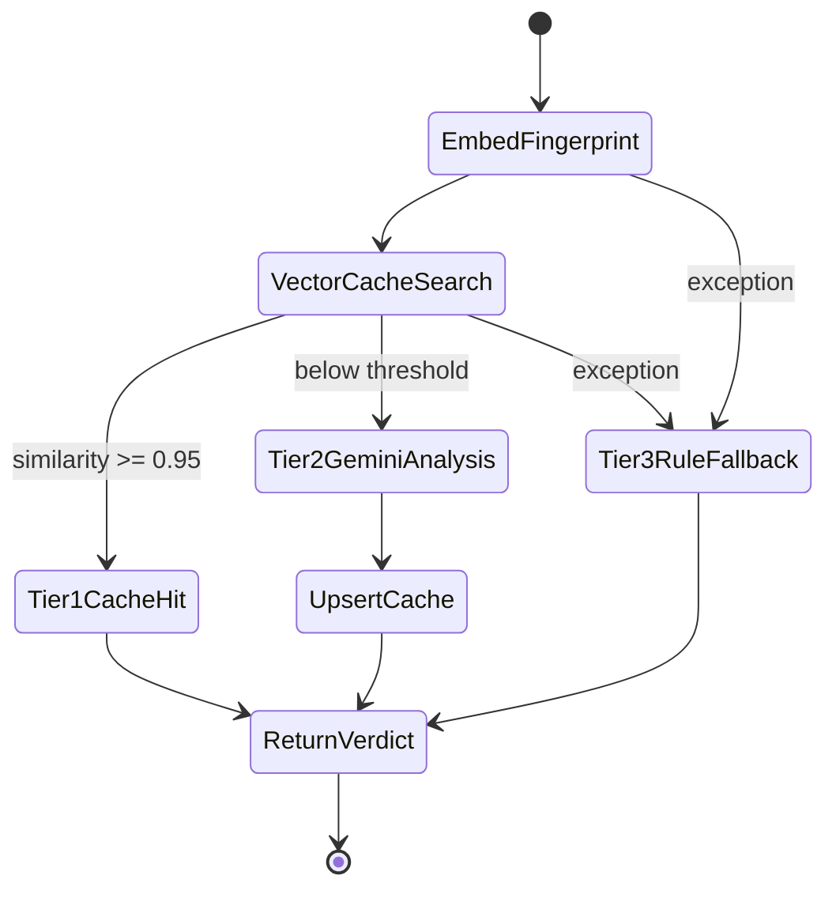

The semantic cache embeds a {{c1::text fingerprint}} of fields like
`Amount | Type | Category | Time | Merchant` — not the {{c2::transaction ID}}
— so transactions with different IDs but the same risk profile can share a
{{c3::cache entry}} within the similarity threshold.

Extra: sentinel-l7 · Phase 3 · Pattern: Semantic Fingerprint as Cache Key
See: docs/journal.md#phase-3

---
type: cloze
deck: Rhizome::sentinel-l7
tags: [sentinel-l7, phase-3, metrics]
---
Sentinel pipeline metrics (hit/miss/fallback counts, cumulative latency) live
in Redis as plain key/value pairs under {{c1::sentinel_metrics_*}}, tracked via
{{c2::Cache::increment}} — zero schema, reset with
{{c3::php artisan sentinel:reset-metrics}}.

Extra: sentinel-l7 · Phase 3 · Pattern: Cache::increment for Zero-Schema Metrics
See: docs/journal.md#phase-3

---
type: cloze
deck: Rhizome::sentinel-l7
tags: [sentinel-l7, phase-3, upstash]
---
Upstash Vector query responses wrap matches under the key {{c1::result}}
(singular) — reading {{c2::results}} (plural) doesn't error, it silently
returns null, indistinguishable from "no match found."

Extra: sentinel-l7 · Phase 3 · Anti-Pattern Avoided: Unwrapping the Upstash Response Envelope Incorrectly
See: docs/journal.md#phase-3

---
type: cloze
deck: Rhizome::sentinel-l7
tags: [sentinel-l7, phase-3, fingerprint]
---
The transaction fingerprint originally embedded an exact {{c1::HH:MM
timestamp}}, so two semantically identical transactions a minute apart produced
different vectors and never hit the cache; replaced with {{c2::time-of-day
buckets}} (night/morning/afternoon/evening) per ADR-0001.

Extra: sentinel-l7 · Phase 3 · Anti-Pattern Avoided: Exact Timestamps in the Fingerprint
See: docs/journal.md#phase-3

---
type: cloze
deck: Rhizome::sentinel-l7
tags: [sentinel-l7, phase-3, upstash, embeddings]
---
Upstash Vector namespaces have a {{c1::fixed dimension}} set at creation time —
upserting a {{c2::1536}}-dim vector (Gemini `embedding-001` with
`output_dimensionality: 1536`) into a namespace created for {{c3::768}} dims
returns a {{c4::400}} error; the fix is to delete and recreate the namespace.

Extra: sentinel-l7 · Phase 3 · Challenge: Gemini Embedding Dimension Mismatch
See: docs/journal.md#phase-3

---
type: cloze
deck: Rhizome::sentinel-l7
tags: [sentinel-l7, phase-3, testing]
---
{{c1::Http::fake()}} must be called {{c2::before}} the service under test is
instantiated — it swaps the client at the facade level, so a service
constructed first may already hold a reference to the {{c3::real}} client.

Extra: sentinel-l7 · Phase 3 · Challenge: Http::fake() Ordering Relative to Instantiation
See: docs/journal.md#phase-3

---
type: cloze
deck: Rhizome::sentinel-l7
tags: [sentinel-l7, phase-3, semantic-cache, adr]
---
The transaction semantic cache similarity threshold is set conservatively to
{{c1::0.95}} because the cost of a {{c2::false positive}} (returning a stale
verdict for a transaction with compliance-relevant differences) outweighs the
cost of a {{c3::cache miss}} (a redundant AI call). ADR-0015 tracks lowering it.

Extra: sentinel-l7 · Phase 3 · Decision: Similarity Threshold of 0.95 for the Transaction Cache
See: docs/journal.md#phase-3

---
type: image-occlusion
deck: Rhizome::sentinel-l7
tags: [sentinel-l7, phase-3, pipeline, graceful-degradation]
diagram: phase-3-tiered-pipeline
---
occlusions:
  - node: Tier1CacheHit
    hint: tier 1 — what happens on a vector cache hit?
    rect: left=.08:top=.32:width=.34:height=.09
  - node: Tier2GeminiAnalysis
    hint: tier 2 — what runs on a cache miss?
    rect: left=.50:top=.32:width=.40:height=.09
  - node: Tier3RuleFallback
    hint: tier 3 — what runs if embedding or vector search throws?
    rect: left=.08:top=.58:width=.42:height=.09

Header: Tiered Fallback Pipeline (Graceful Degradation)
Back Extra: sentinel-l7 · Phase 3 · Pattern: Tiered Fallback Pipeline (Graceful Degradation)
See: docs/journal.md#phase-3

