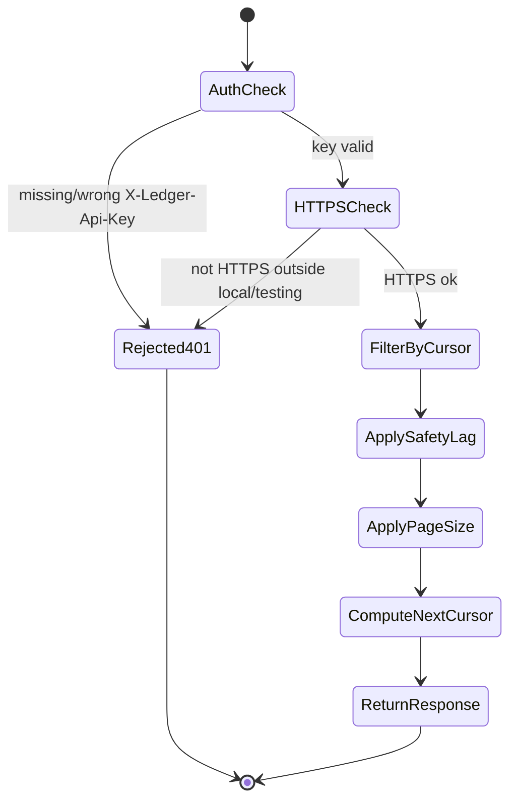

Q: Why did the `GET /usage` endpoint use a shared `X-Ledger-Api-Key`
header instead of wiring up Sanctum?

A: Sanctum was a dependency-present-but-fully-unconfigured option in this
app — no migration, no `HasApiTokens`, nothing — disproportionate to one
known external consumer (Ledger-L5). A lightweight header checked against
a config-backed secret (`services.ledger_l5.api_key`) is proportionate
now; the decision explicitly leaves room to revisit toward Sanctum if a
second external consumer or per-caller token revocation is ever needed.

Extra: sentinel-l7 · Phase 22 · Decision: Shared API-Key Header, Not Sanctum
See: docs/journal/sentinel-l7-2026-07-09T0945-usage-endpoint-built.md

---
type: cloze
deck: Rhizome::sentinel-l7
tags: [sentinel-l7, phase-22, cursor-pagination]
---
`sentinel.usage.page_size` (default {{c1::500}}) caps each pipeline's rows
per call without adding a new query parameter — `next_cursor` simply
reflects {{c2::whatever was actually returned}}, so Ledger-L5 naturally
paginates across multiple calls when there's more than a page's worth of
new rows.

Extra: sentinel-l7 · Phase 22 · Decision: Server-Side Page Size, No New Query Param
See: docs/journal/sentinel-l7-2026-07-09T0945-usage-endpoint-built.md

---
type: cloze
deck: Rhizome::sentinel-l7
tags: [sentinel-l7, phase-22, api-key-auth, observability]
---
Per explicit direction, a missing or wrong `X-Ledger-Api-Key` returns
{{c1::401}} (not an empty 200), and the presented key is
{{c2::never logged}} — only whether it matched — so a caller
misconfiguration reads as "unauthenticated," not "no new usage yet."

Extra: sentinel-l7 · Phase 22 · Pattern: Loud Failure Over Silent Success for Caller Misconfiguration
See: docs/journal/sentinel-l7-2026-07-09T0945-usage-endpoint-built.md

---
type: cloze
deck: Rhizome::sentinel-l7
tags: [sentinel-l7, phase-22, testing, https]
---
`withServerVariables(['HTTPS' => 'on'])` failed to make
`$request->isSecure()` true for a relative-path test request, because
Symfony's `Request::create()` derives the `HTTPS` server var from the
{{c1::request URL's own scheme}} — fixed by passing an absolute
{{c2::https://}} URL directly instead of faking the server variable.

Extra: sentinel-l7 · Phase 22 · Challenge: HTTPS server-variable faking doesn't override URL-derived scheme
See: docs/journal/sentinel-l7-2026-07-09T0945-usage-endpoint-built.md

---
type: cloze
deck: Rhizome::sentinel-l7
tags: [sentinel-l7, phase-22, testing, eloquent]
---
`created_at` isn't `$fillable` on `Transaction`/`ComplianceEvent`, so
passing it through `Model::create()`'s overrides array silently no-ops
(Eloquent stamps "now" regardless) — backdating a test row past the
safety-lag window requires {{c1::direct property assignment}}
(`$model->created_at = ...; $model->save();`) after creation.

Extra: sentinel-l7 · Phase 22 · Challenge: created_at overrides silently no-op through mass assignment
See: docs/journal/sentinel-l7-2026-07-09T0945-usage-endpoint-built.md

---
type: image-occlusion
deck: Rhizome::sentinel-l7
tags: [sentinel-l7, phase-22, usage-endpoint, cursor-pagination, pipeline]
diagram: usage-endpoint-request-flow
---
occlusions:
  - node: AuthCheck
    hint: what does GET /usage check first, and what does it return on a
      missing or wrong key?
    rect: left=.08:top=.20:width=.36:height=.09
  - node: ApplySafetyLag
    hint: what window excludes very-recently-written rows from the
      response, to avoid a race with an in-flight write?
    rect: left=.08:top=.55:width=.40:height=.09
  - node: ComputeNextCursor
    hint: how does next_cursor behave when a pipeline has no new rows?
    rect: left=.52:top=.72:width=.40:height=.09

Header: GET /usage Dual-Cursor Request Flow (ADR-0029)
Back Extra: sentinel-l7 · Phase 22 · Pattern: Loud Failure Over Silent Success; Decision: Server-Side Page Size
See: docs/journal/sentinel-l7-2026-07-09T0945-usage-endpoint-built.md

