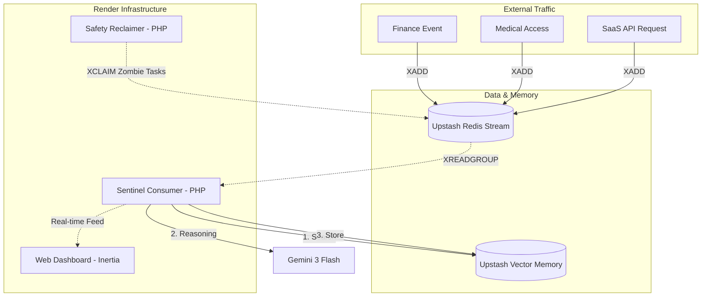

```mermaid
graph TB
    subgraph "External Traffic"
        T1[Finance Event]
        T2[Medical Access]
        T3[SaaS API Request]
    end

    subgraph "Render Infrastructure"
        Web[Web Dashboard - Inertia]
        Worker[Sentinel Consumer - PHP]
        Reclaimer[Safety Reclaimer - PHP]
    end

    subgraph "Data & Memory"
        Stream[(Upstash Redis Stream)]
        Vector[(Upstash Vector Memory)]
    end

    T1 & T2 & T3 -->|XADD| Stream
    Stream -.->|XREADGROUP| Worker
    Worker -->|1. Search| Vector
    Worker -->|2. Reasoning| AI[Gemini 3 Flash]
    Worker -->|3. Store| Vector

    Reclaimer -.->|XCLAIM Zombie Tasks| Stream
    Worker -.->|Real-time Feed| Web
```